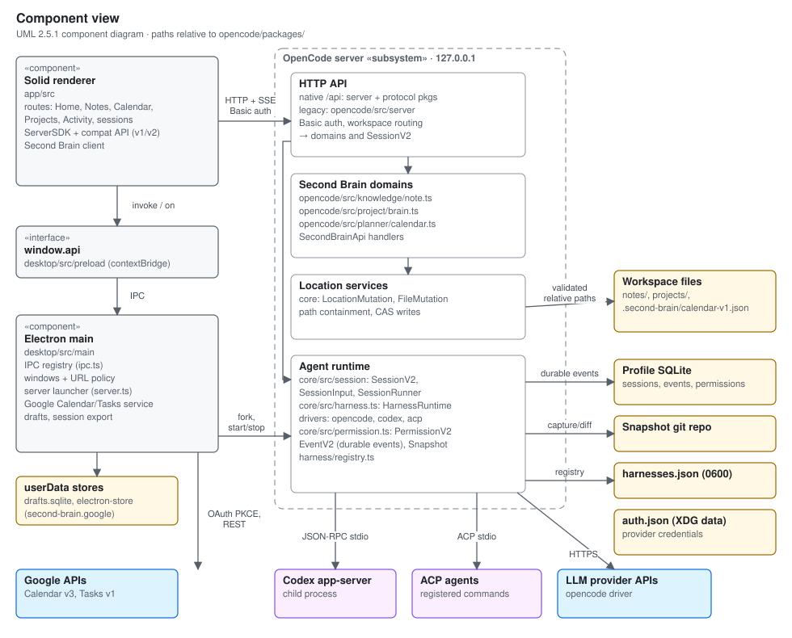

# Architecture

Second Brain OS is an OpenCode fork. The Solid renderer, Electron host, and
managed local OpenCode server remain the base application. New product domains
are added inside the existing OpenCode application rather than replacing its
shell or agent runtime.

The previous React/Tauri and Rust implementation is retired. Its database
schemas and remaining migration gaps are recorded in
[the donor archive](../archive/tauri/README.md).

## Active components

Detailed UML views (deployment, class, activity, state machine and sequence)
and a coverage index are in [the UML architecture views](uml.md).

- The Electron main process creates windows, exposes the limited preload API,
  and starts the managed server in a utility process on loopback with a
  generated password.
- The Solid renderer owns the desktop UI, including Brain, notes, projects,
  and calendar pages in `opencode/packages/app/src/pages/`.
- The OpenCode server owns sessions, workspace routing, and Second Brain HTTP
  handlers. `packages/opencode` mounts the native `/api` routes from
  `packages/server` (contracts in `packages/protocol`) next to its legacy
  instance routes; the session and harness runtime lives in `packages/core`. Notes and project records use workspace files through the location
  and file mutation services; calendar data is stored under `.second-brain/`.
- Former Rust policy and release documents are historical requirements, not
  evidence of controls in the active desktop runtime.

The renderer must not gain direct Node or filesystem access. Keep new native
operations behind the preload and main-process boundary, and resolve Second
Brain files through the server's location services. See
[`ADR-010`](../adr/ADR-010-opencode-electron-base.md) for the base-app decision.

## Product entry points and persistence

`opencode/packages/app/src/app.tsx` owns routing. The current layout exposes
Home, Workspaces, Notes, Calendar, Projects, Activity, and agent sessions.
Settings, model/provider selection, file panels, and terminals are shared
dialogs or session panels rather than standalone routes.

| Data                       | Owner and persistence                                                                                                 |
| -------------------------- | --------------------------------------------------------------------------------------------------------------------- |
| Notes                      | `packages/opencode/src/knowledge/note.ts`; workspace Markdown files                                                   |
| Project records            | `packages/opencode/src/project/brain.ts`; workspace `projects/` Markdown cards and project folders                    |
| Local events and tasks     | Second Brain HTTP handler and `packages/opencode/src/planner/calendar.ts`; workspace `.second-brain/calendar-v1.json` |
| Sessions and runtime state | `packages/core/src/database/` and runtime session services; `opencode.db` in the XDG data directory                   |
| Unsent desktop drafts      | `packages/desktop/src/main/draft-store.ts`; profile `drafts.sqlite`                                                   |
| Google connections         | `packages/desktop/src/main/google-calendar.ts`; encrypted credentials in the desktop profile                          |

Package paths in this table are relative to `opencode/`. Workspace files are
the source of truth for notes, project records, and local planning. Do not
assume the session or draft databases can be reconstructed from those files.

## Home navigation

Home renders its shell independently of dashboard requests. Panel content,
metrics, and the harness selector have local loading boundaries. Harness
availability uses the renderer query cache, keyed by server and workspace
directory, with 30 seconds of freshness and background refresh on stale
re-entry. Projects and calendar data still reload on each visit.

## Startup and request flow

1. Electron starts the bundled server in a utility process and gives the
   renderer its loopback URL and generated credentials through preload IPC.
2. The renderer detects server capabilities. The managed server combines
   current session routes with legacy project and MCP routes; compatibility
   lives in `packages/app/src/utils/server-protocol.ts` and `server-compat.ts`.
3. Workspace bootstrap loads configuration, initializes plugins, and then
   starts workspace services. Server readiness precedes this work. Startup
   phase logs in `packages/opencode/src/project/bootstrap.ts` distinguish it
   from initial server launch.
4. Notes, projects, and local calendar requests resolve the selected location
   before reading or mutating files. Google operations use the desktop bridge.

The packaged desktop disables embedded web UI fallback. Missing `/api` routes
return a local error rather than fetching the hosted OpenCode website. The
optional upstream CLI is a separate runtime from the fork's bundled server;
see [release operations](../release-operations.md).

## Harness drivers and registration

`packages/core/src/harness.ts` runs each Run turn through a Harness instance.
Three drivers execute: `opencode` (in-process provider calls), `codex`
(Codex app-server JSON-RPC), and `acp` (any agent that speaks the Agent Client
Protocol over stdio, in `packages/core/src/harness/acp.ts`). Instances come
from built-ins, then the app-owned `harnesses.json` registry in the global
config directory, then `harnesses` entries in config files. Later sources win,
except that the registry can't replace `opencode` or `codex`. The registry is
re-read on each list and stream call, so new entries appear without a restart.

ACP sessions are created with `session/new`, or reopened with `session/load`
when the agent supports it. The ACP session ID is stored as the Run's harness
continuation. The client advertises no file-system or terminal capability;
the agent uses its own tools and asks permission through
`session/request_permission`, which maps to Second Brain approvals. ACP agents
receive no Second Brain system prompt. An agent reports its models either in
the legacy `models` field or as a `configOptions` select of category `model`.
The driver switches models with `session/set_model` or
`session/set_config_option` to match.

Users manage ACP harnesses in Settings → Harnesses. The page calls
`/api/harness/settings`, `/api/harness/discover`, and
`/api/harness/registry[/:id]`. Their thin handlers in
`packages/server/src/handlers/harness.ts` delegate to `HarnessRuntime`, which
uses `packages/core/src/harness/registry.ts`:

- Test runs the ACP handshake and `session/new` to list models, and writes
  nothing.
- Save checks the command again and appends the entry.
- Enable/disable and remove change only `harnesses.json` entries.

Built-ins and config-file entries are read-only. After each change the runtime
refreshes its cached instance list, so the next turn and the picker see it.
Agents have no tool for registering harnesses.

## Session compatibility and review

The managed server uses native `/api/session` execution and history alongside
legacy project, file, Git, rename, archive, and PTY connection routes. The
renderer selects those supported routes through capability detection rather
than assuming that every operation uses one API generation. PTY sockets use
short-lived tickets from the legacy connection endpoint on managed servers
and the native `/api/pty` endpoints on servers using only the current API.

Native forks copy the selected history into a new session through durable
`session.next.message.imported` events. Forks receive new message IDs and do
not inherit provider continuation handles or filesystem snapshots. The
native `POST /api/session/:sessionID/fork` endpoint preserves the selected
harness and model.

`GET /api/session/:sessionID/diff` compares the first and last assistant
snapshots after the selected user prompt, stopping at the next user prompt.
Snapshot capture discovers Git initialized after a workspace is already open.
Renderer Last turn review uses this endpoint; working-tree and branch review
use the managed server's legacy Git routes. File search refreshes the
ripgrep fallback on each query so newly written files are discoverable.

Desktop session export reads all native history pages, projects the existing
CLI JSON format, and invokes the narrow preload save operation. Main owns the
native destination picker and completes the file write before reporting
success. Browser downloads cannot confirm saving and do not show that toast.
