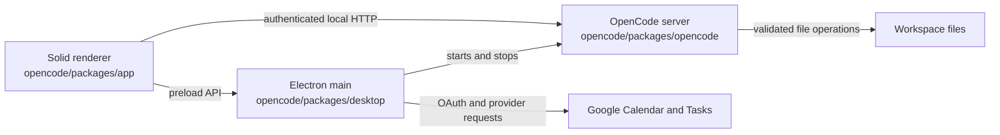

# Architecture

Second Brain OS is an OpenCode fork. The Solid renderer, Electron host, and
managed local OpenCode server remain the base application. New product domains
are added inside the existing OpenCode application rather than replacing its
shell or agent runtime.

The previous React/Tauri and Rust implementation remains donor code during the
migration. Code moves from it only when a Second Brain feature is added to the
OpenCode base.

## Active components

- The Electron main process creates windows, exposes the limited preload API,
  and starts the managed server on loopback with a generated password.
- The Solid renderer owns the desktop UI, including Brain, notes, projects,
  and calendar pages in `opencode/packages/app/src/pages/`.
- The OpenCode server owns sessions, workspace routing, and Second Brain HTTP
  handlers. Notes and project records use workspace files through the location
  and file mutation services; calendar data is stored under `.second-brain/`.
- `app/` contains the former React/Tauri implementation. Its Rust policy and
  release documents do not describe the active desktop runtime.

The renderer must not gain direct Node or filesystem access. Keep new native
operations behind the preload and main-process boundary, and resolve Second
Brain files through the server's location services. See
[`ADR-010`](../adr/ADR-010-opencode-electron-base.md) for the base-app decision.

## Home navigation

Home renders its shell independently of dashboard requests. Panel content,
metrics, and the harness selector have local loading boundaries. Harness
availability uses the renderer query cache, keyed by server and workspace
directory, with 30 seconds of freshness and background refresh on stale
re-entry. Projects and calendar data still reload on each visit.
