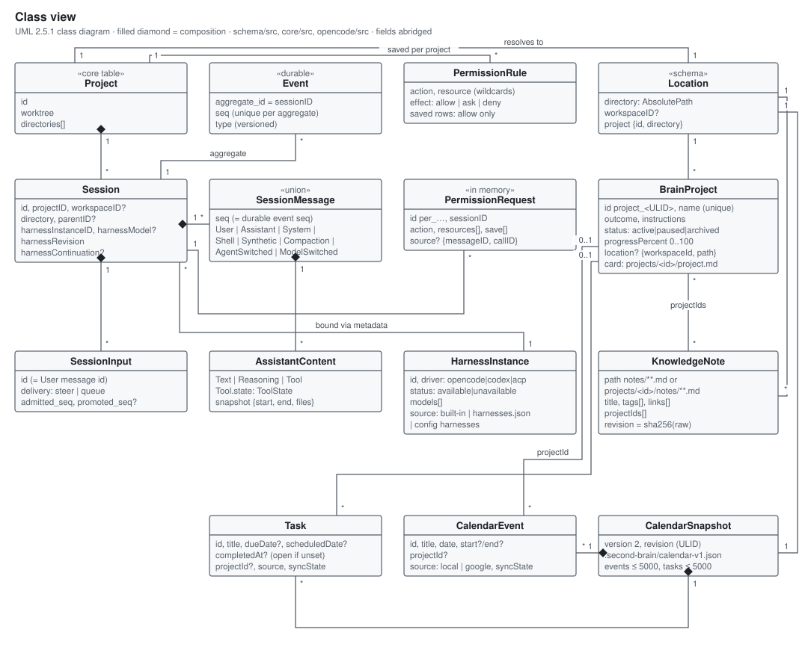
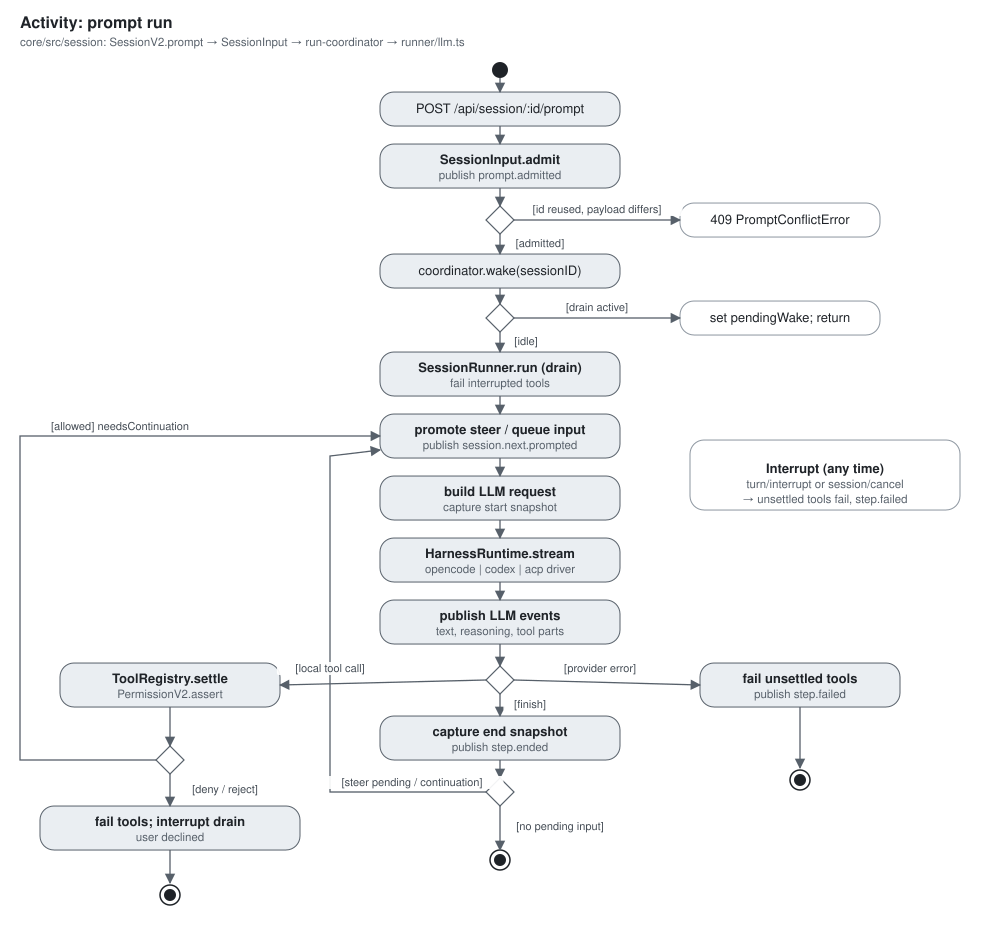
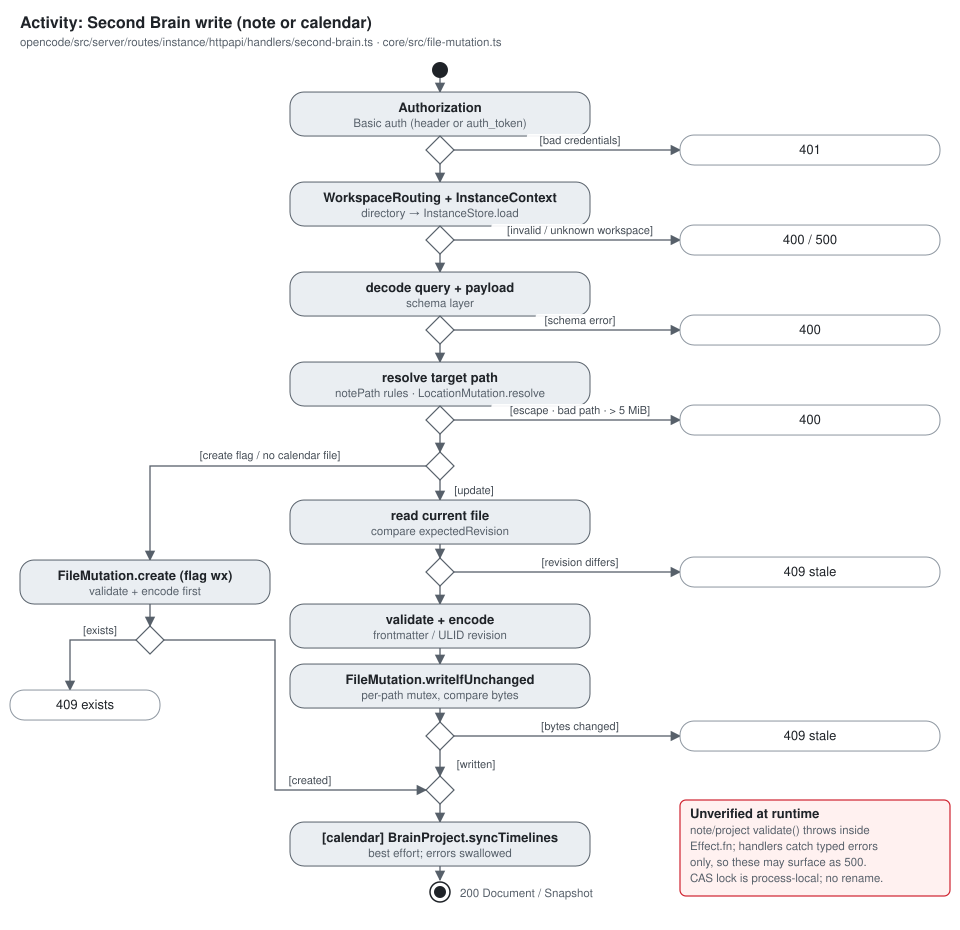
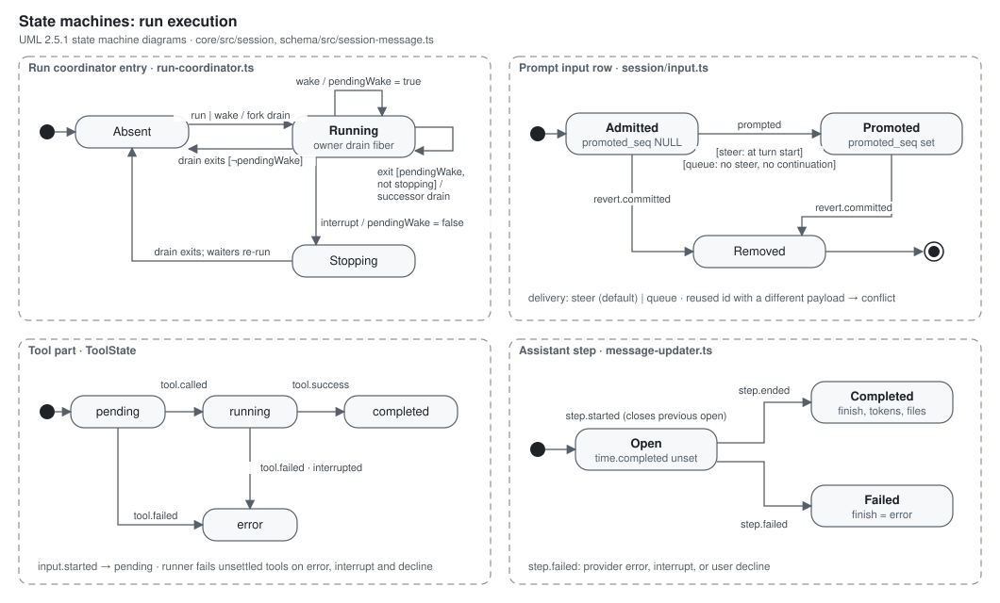
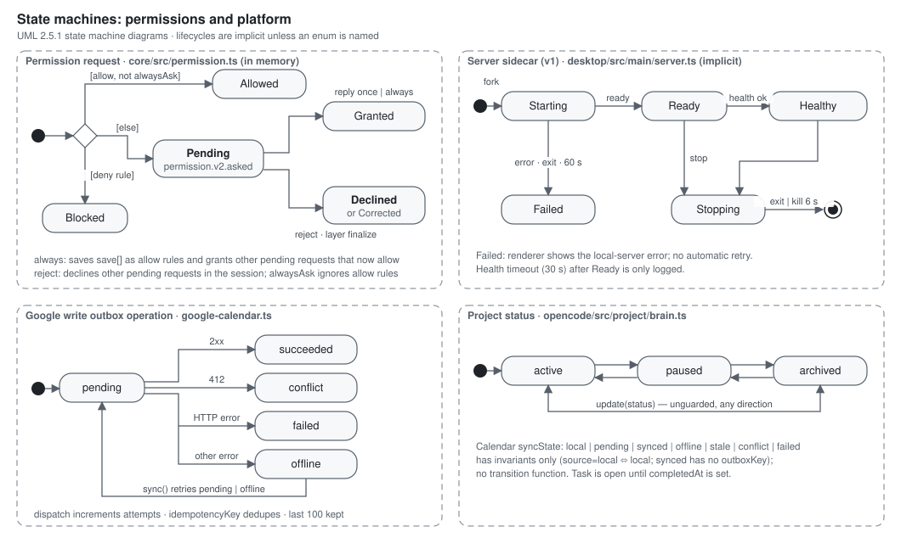
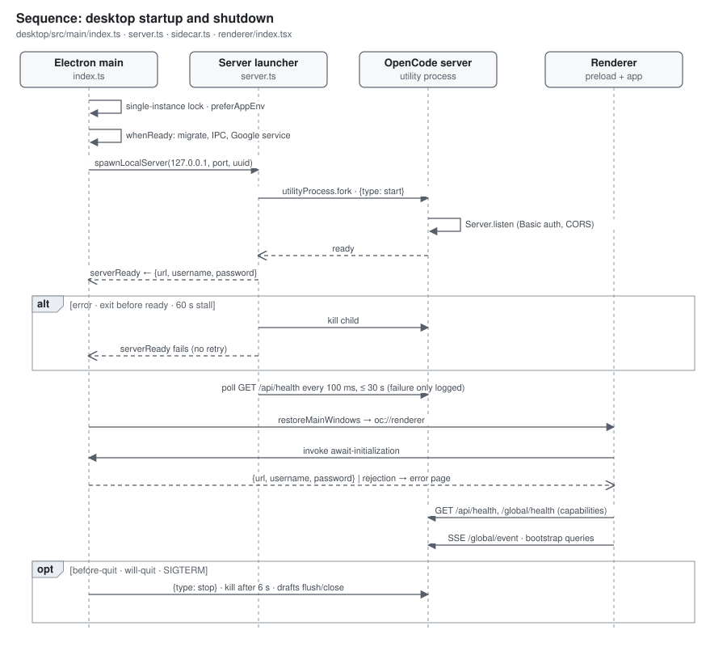
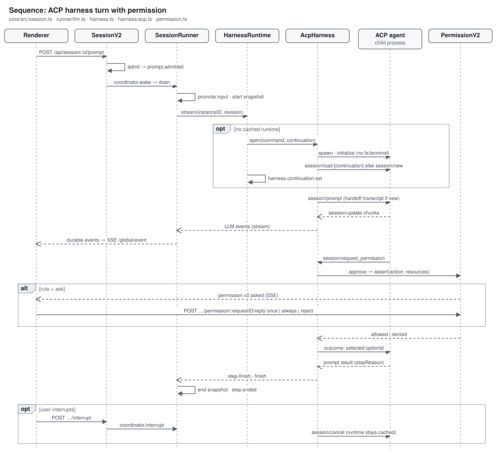

# Architecture views (UML)

This is the master graph document for the active Electron/OpenCode app. The
[architecture overview](README.md) explains component boundaries in prose,
and the [threat model](../security/threat-model.md) owns trust boundaries.
This document holds the detailed views.

Conventions:

- Notation follows [UML 2.5.1](https://www.omg.org/spec/UML/2.5.1). Each family
  appears in a fixed order: structural (component, deployment, class), then
  behavioral (activity, state machine), then interaction (sequence).
- Source paths are relative to `opencode/packages/` unless a diagram says
  otherwise.
- Solid arrows are calls or data flow, and dashed arrows are replies or
  optional paths. Red boxes mark known gaps or relationships that haven't been
  verified at runtime.
- The SVGs in [`docs/diagrams/`](../diagrams/) are generated by the Python
  scripts in [`docs/diagrams/generate/`](../diagrams/generate/). Edit a script
  and run the command in its header, or edit the SVG directly.

The views were mapped from source on 2026-10-05. They are a source-level
reading of the code, not a runtime trace, except where a step says it was run.

## Structural views

### Component

| Component | Responsibility | Source |
| --- | --- | --- |
| Solid renderer | Routes, server connection and capability detection, compat API, Second Brain pages | `app/src/app.tsx`, `app/src/context/server-sdk.tsx`, `app/src/utils/server-compat.ts`, `app/src/features/second-brain/client.ts` |
| Preload bridge | Exposes `window.api` through an allowlist of IPC wrappers | `desktop/src/preload/index.ts` |
| Electron main | App lifecycle, windows and URL policy, IPC handlers, server launch, Google service, drafts | `desktop/src/main/index.ts`, `ipc.ts`, `windows.ts`, `server.ts`, `google-calendar.ts`, `draft-store.ts` |
| HTTP API | Native `/api` routes plus legacy instance routes, with Basic auth and workspace routing | `server/src/handlers/`, `protocol/src/groups/`, `opencode/src/server/routes/instance/httpapi/` |
| Second Brain domains | Notes, project cards and timelines, local calendar | `opencode/src/knowledge/note.ts`, `opencode/src/project/brain.ts`, `opencode/src/planner/calendar.ts` |
| Location services | Path containment and compare-and-swap file writes | `core/src/location-mutation.ts`, `core/src/file-mutation.ts`, `core/src/location-services.ts` |
| Agent runtime | Prompt admission, run draining, harness dispatch, permissions, durable events, snapshots | `core/src/session.ts`, `core/src/session/`, `core/src/harness.ts`, `core/src/harness/`, `core/src/permission.ts`, `core/src/event.ts`, `core/src/snapshot.ts` |

### Deployment

- The server runs in an Electron `utilityProcess` on `127.0.0.1` at an
  ephemeral port. Its password is a UUID generated at each launch
  (`desktop/src/main/index.ts`, `server.ts`).
- `userData` is `appData/<appId>`. The server sets `XDG_STATE_HOME` to
  `userData` by default, but `auth.json` and `opencode.db` live in the XDG
  data directory (`core/src/global.ts`, `core/src/database/database.ts`,
  `opencode/src/auth/index.ts`).
- The `opencode-cli` daemon (`OPENCODE_SIDECAR_V2=1`) ships only in the
  development channel. Packaging and update limits are covered in
  [release operations](../release-operations.md).

### Class

Notes on the class view:

- A session's harness binding (instance, model, revision and continuation)
  lives in the session's `metadata` JSON. It has no separate table.
- Permission requests exist only in memory. Saved permission rows are allow
  rules, scoped to a project.
- `BrainProject` and `KnowledgeNote` are Markdown files. `CalendarSnapshot` is
  one JSON file per location. None of them is stored in SQLite.

## Behavioral views

### Activity: prompt run

Runtime notes:

- Tools run by Codex or ACP agents are provider-executed. The runner only
  records them, and their approvals arrive through the harness permission
  bridge.
- If the user declines a local tool, the drain stops. A declined ACP
  permission instead sends a reject option back to the agent.

### Activity: Second Brain write

Some details of the write path:

- A calendar write replaces the whole `{events, tasks}` document; there is no
  per-task endpoint.
- Notes, projects and the calendar use different revisions:
  - notes: a SHA-256 hash of the file;
  - projects: `updatedAt`;
  - calendar: a ULID.
- No delete endpoints exist for notes, projects or tasks.

### State machines

Some lifecycles have no enum and are implicit in control flow: the sidecar
process and the coordinator entry. The diagrams name the states for
discussion. The V2 runtime emits no `session.status` busy or idle events, so
"busy" is derived from the coordinator's active set (`core/src/session/run-coordinator.ts`).

## Interaction views

### Sequence: desktop startup

### Sequence: ACP harness turn

The Codex driver follows the same outline. It speaks the `codex app-server`
JSON-RPC protocol (`thread/start` or `thread/resume`, `turn/start`,
`turn/interrupt`) instead of ACP. Its approvals come from
`item/*/requestApproval` requests.

## Coverage index

| Subject | Kind | Views | Source |
| --- | --- | --- | --- |
| Renderer routing and server connection | Subsystem | Component, Deployment, Sequence: startup | `app/src/app.tsx`, `app/src/utils/server-protocol.ts` |
| Preload and IPC | Subsystem | Component, Sequence: startup | `desktop/src/preload/index.ts`, `desktop/src/main/ipc.ts` |
| Server launch and lifecycle | Subsystem | Deployment, State: sidecar, Sequence: startup | `desktop/src/main/server.ts`, `desktop/src/main/sidecar.ts` |
| Second Brain notes, projects, calendar | Subsystem | Component, Class, Activity: write, State: project status | `opencode/src/knowledge/`, `opencode/src/project/brain.ts`, `opencode/src/planner/calendar.ts` |
| Location services | Subsystem | Component, Activity: write | `core/src/location-mutation.ts`, `core/src/file-mutation.ts` |
| Session runtime | Subsystem | Component, Class, Activity: prompt run, State: run, Sequence: ACP turn | `core/src/session.ts`, `core/src/session/` |
| Harness drivers and registry | Subsystem | Component, Deployment, Class, Sequence: ACP turn | `core/src/harness.ts`, `core/src/harness/acp.ts`, `core/src/harness/registry.ts`, `server/src/handlers/harness.ts` |
| Permissions | Subsystem | Activity: prompt run, State: permission, Sequence: ACP turn | `core/src/permission.ts`, `core/src/plugin/agent.ts` |
| Workspace files | Shared store | Component, Deployment, Activity: write | `notes/`, `projects/`, `.second-brain/calendar-v1.json` |
| Profile SQLite (`opencode.db`) | Shared store | Component, Deployment, Class | `core/src/database/`, `core/src/event.ts` |
| Snapshot repository | Shared store | Component, Class, Activity: prompt run | `core/src/snapshot.ts` |
| `harnesses.json` | Shared store | Component, Deployment | `core/src/harness/registry.ts` (written only from Settings → Harnesses through `/api/harness/registry`) |
| `drafts.sqlite`, electron-store files | Shared store | Component, Deployment | `desktop/src/main/draft-store.ts`, `desktop/src/main/store.ts` |
| Google Calendar and Tasks | External integration | Component, Deployment, State: outbox | `desktop/src/main/google-calendar.ts` |
| LLM providers | External integration | Component, Deployment | `core/src/harness.ts` (`opencode` driver) |
| Codex app-server, ACP agents | External integration | Component, Deployment, Sequence: ACP turn | `core/src/harness.ts`, `core/src/harness/acp.ts` |
| Prompt run | Critical workflow | Activity: prompt run, Sequence: ACP turn | `core/src/session/runner/llm.ts` |
| Note or calendar write | Critical workflow | Activity: write | `opencode/src/server/routes/instance/httpapi/handlers/second-brain.ts` |
| Desktop startup | Critical workflow | Sequence: startup | `desktop/src/main/index.ts` |
| Harness settings (add, toggle, remove) | Critical workflow | Component | `app/src/components/settings-v2/harnesses.tsx`, `server/src/handlers/harness.ts`, `core/src/harness/registry.ts` |

## Unverified relationships and assumptions

The following were inferred from source and haven't been confirmed at runtime.

- **Second Brain middleware order.** The middleware order for Second Brain
  routes (authorization outermost) was inferred from Effect layer types.
- **Note and project validation errors.** Note and project `validate()` throws
  synchronously inside `Effect.fn`. The handlers catch only typed failures,
  so invalid titles, tags, names or progress values may return 500 instead of
  400.
- **Process-local write lock.** File compare-and-swap uses a process-local
  mutex and writes in place rather than renaming a temporary file. A second
  process writing the same workspace isn't excluded.
- **Dead ACP runtimes.** An ACP agent that exits mid-turn is turned into
  error events, not a stream error. The dead runtime may stay cached until
  the harness revision changes.
- **v2 CLI daemon.** The v2 CLI daemon isn't stopped by `killSidecar`. On
  packaged beta or production builds it would also be missing, because only
  the development channel bundles it.
- **Server health checks.** A health-check failure after the server reports
  ready is only logged. The renderer isn't told.

## Not drawn

- Renderer internals (providers, query caches, stores) are summarized in the
  component table instead of drawn. They change often and have no trust
  boundary.
- The legacy V1 session runtime in `opencode/src/session/` is still mounted
  for legacy routes but isn't used by Harness runs. It's left out to keep the
  views readable.
- WSL sidecars appear only in the deployment view. Their internals weren't
  mapped.
