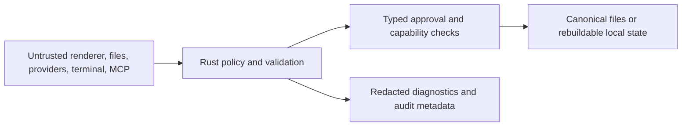

# Checkpoint 35 hardening evidence

This is a repeatable smoke baseline, not formal security certification,
assistive-technology certification, or a large-scale performance benchmark.

## Performance

Run:

```sh
cargo test -p second-brain-os --test hardening policy_hot_paths_stay_within_smoke_budget -- --nocapture
```

The harness measures 10,000 validated workspace-relative paths and 10,000
authenticated MCP authorizations. Each has a two-second smoke budget in a
debug test build. Record the printed durations and target machine in release
evidence; do not compare results across machines as if they were equivalent.

Observed 2026-07-28 on Darwin arm64, Rust 1.88.0 debug test build:

| Operation                    |  Count |  Elapsed | Budget |
| ---------------------------- | -----: | -------: | -----: |
| Workspace path validation    | 10,000 |   9.7 ms |    2 s |
| MCP capability authorization | 10,000 | 472.8 ms |    2 s |

Startup, filesystem discovery at 10k/100k files, one-million-chunk search,
300-node rendering, 10k planner items, six high-output terminals, and
long-session memory growth are not measured by this slice and remain
release-gate work.

## Accessibility

Run:

```sh
pnpm --filter @second-brain-os/app test -- hardening.test.tsx
```

| Check                                  | Automated evidence                                                 | Disposition                                          |
| -------------------------------------- | ------------------------------------------------------------------ | ---------------------------------------------------- |
| Landmarks and accessible control names | Shell role/name assertions                                         | Covered                                              |
| Keyboard command palette and focus     | Ctrl/Cmd+K, focus, Escape assertions                               | Covered                                              |
| Graph non-canvas alternative           | Named relationship list and keyboard node activation               | Covered                                              |
| Planner non-canvas workflow            | Native form, list, and checkbox assertions                         | Covered                                              |
| Visible focus                          | Every tested shell button accepts focus; CSS uses `:focus-visible` | Partial; visual inspection remains                   |
| Screen reader                          | Not run                                                            | Must test one supported screen reader before release |
| High contrast, 200% zoom, target size  | Not run                                                            | Manual release matrix                                |
| Reduced motion                         | No product motion identified in this audit                         | Recheck third-party widgets                          |
| Remappable shortcuts                   | Not implemented                                                    | Accepted V1 limitation pending product decision      |

## Security dispositions

Run:

```sh
cargo test -p second-brain-os --test hardening adversarial_inputs_fail_closed_and_secrets_are_redacted
```

| Threat-model surface      | Evidence or disposition                                                                                      |
| ------------------------- | ------------------------------------------------------------------------------------------------------------ |
| Renderer/Tauri IPC        | Capability file remains allowlist-only; privileged command audit remains release review                      |
| Workspace files           | Traversal, absolute, Windows-host, encoded traversal, and NUL-like inputs fail closed                        |
| Untrusted workspace       | Trust-policy unit coverage exists; no new auto-execution surface added                                       |
| Markdown/HTML/Mermaid/PDF | Contracts require sanitized/disabled active content; viewer adversarial execution testing remains open       |
| MCP sidecar               | Forged token, path escape, and stale policy revision fail closed                                             |
| Terminal/PTY              | Escape filtering and destructive-process review remain open                                                  |
| Agents/provider content   | Existing derived test marks retrieved injection text as data; hidden reasoning is dropped                    |
| Google/provider APIs      | Existing idempotent outbox and participant-approval tests are the evidence; live replay testing remains open |
| Database/migrations       | Checkpoint 34 covers verified backup, rollback restore, corrupt input, and newer-schema refusal              |
| Secrets/telemetry         | Nested credential fields and token-shaped strings are absent after redaction                                 |

No new critical or high finding was observed in this bounded regression slice.
Dependency advisories, licenses, secret scanning, capability review, viewer
execution tests, and terminal escape tests must be completed before making the
broader “no known high-severity issue” release claim.

## Data flow


