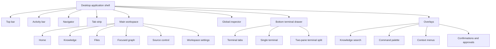
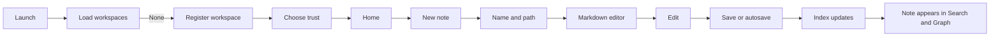

# Second Brain OS — Product Designer Handoff

**Document status:** Designer-ready UX map  
**Prepared from:** Current frontend implementation, tests, security contracts, implementation checkpoints, and the master product plan  
**Product type:** macOS-first local desktop application (Tauri), with Windows and Linux compatibility preserved  
**Primary user:** A technically capable individual managing personal knowledge, projects, source files, terminals, plans, and AI-agent work  
**Last mapped:** 2026-07-28

---

## 1. Why this document exists

This document tells a product designer what must be designed for Second Brain OS:

- every currently reachable page or application surface;
- every important overlay, panel, drawer, menu, and system state;
- how users move between those surfaces;
- what each control does;
- what loading, empty, error, read-only, stale, offline, conflict, approval, and recovery states need to look like;
- which experiences are implemented today;
- which experiences have product and behavior contracts but still need frontend integration;
- which questions should be resolved before high-fidelity design begins.

This is not a visual redesign. It is a behavioral and information-architecture handoff. The designer should use it to create:

1. application-shell foundations and reusable components;
2. low-fidelity wireframes for the complete information architecture;
3. high-fidelity designs for the current primary surfaces;
4. state variants and interaction prototypes;
5. follow-on designs for planned Version 1 surfaces.

---

## 2. Reading the status labels

Every surface in this document has one of four status labels.

| Label | Meaning |
|---|---|
| **Current / reachable** | A user can reach the surface through the current UI. Its implemented behavior should be treated as the baseline. |
| **Current / contextual** | Implemented and reachable only from a contextual action, overlay, editor state, or drawer. |
| **Built / not connected** | A frontend component and supporting behavior exist, but the surface is not exposed in the current primary navigation. |
| **Planned / specified** | The product plan or security contract defines the behavior, but the complete user interface does not yet exist. |

The distinction matters. “Built / not connected” and “Planned / specified” screens should not be presented as shipped product behavior.

---

## 3. Product in one sentence

Second Brain OS is a local-first knowledge and project IDE that combines Markdown notes, source files, focused graph navigation, terminal sessions, inspectable AI-agent work, local and Google-backed planning, Git change review, and recovery tooling in one desktop workbench.

### 3.1 Core user promise

The user should eventually be able to say:

> Update the architecture note, create implementation tasks, schedule two working blocks this week, and ask Codex to begin the indexer.

The application should then:

1. identify the relevant workspace or project;
2. retrieve only the relevant notes, decisions, files, tasks, and graph nodes;
3. let the user inspect the proposed context and permissions;
4. start a visible or managed agent session;
5. show every file, task, calendar, terminal, and agent change;
6. require confirmation for destructive or external actions;
7. keep canonical information in ordinary local files.

### 3.2 Product principles that should be visible in the design

- **Local-first:** The workspace folder and its ordinary files are primary.
- **Power with boundaries:** Terminals, agents, Git, and external providers are capable but visibly scoped.
- **Inspectability:** Context, provenance, authority, permissions, and changes are never hidden.
- **Reversible by default:** Destructive actions are explicit and recovery paths are visible.
- **Focused, not overwhelming:** Search, graph, and agent context are bounded to the current task.
- **Derived information is labeled:** Inferred or generated content is visibly different from user-authored or provider-authoritative content.
- **Desktop density:** The product is closer to VS Code, Obsidian, Linear, and a terminal workbench than to a mobile productivity app.
- **Portable content:** Rich editing must still preserve human-readable Markdown.

---

## 4. Application model: surfaces, not web pages

Second Brain OS is a single-window desktop workbench. It does not currently use conventional web URLs. “Pages” are activity surfaces rendered inside a persistent shell.



### 4.1 Current primary activity order

The current activity bar exposes:

1. Home
2. Knowledge
3. Files
4. Graph
5. Source Control
6. Settings

Search is an overlay, not a tab. Terminal is a bottom drawer, not a main tab. Planner and Agents have code-backed surfaces but are not in current primary navigation.

---

## 5. Global shell specification

**Status:** Current / reachable  
**Appears on:** Every normal application surface after launch

### 5.1 Desktop layout anatomy

```text
┌─────────────────────────────────────────────────────────────────────────┐
│ Workspace switcher │ Breadcrumb       │ Search │ Bridge │ Inspector │ ▔ │
├──────┬────────────────┬──────────────────────────┬───────────────────────┤
│      │                │ Open view tabs           │                       │
│ Act. │ Navigator      ├──────────────────────────┤ Global inspector      │
│ bar  │                │                          │                       │
│      │                │ Main workspace           │                       │
│      │                │                          │                       │
├──────┴────────────────┴──────────────────────────┴───────────────────────┤
│ Optional vertically resizable terminal drawer                           │
└─────────────────────────────────────────────────────────────────────────┘
```

### 5.2 Top bar

#### Workspace switcher

Current visual:

- square workspace avatar;
- hard-coded “Personal / Workspace” label;
- dropdown chevron.

Current behavior:

- the control is visually interactive but does not open a menu;
- the selected workspace inside the content area is actually managed by the workspace data state, not this control.

Designer requirement:

- design a real switcher menu;
- show brain, project, and collection workspace types;
- show recent workspaces;
- support “Open workspace,” “Add workspace,” and “Open in new window”;
- show trust state and terminal availability where relevant;
- define loading, no-workspaces, missing-folder, and unavailable-workspace states;
- do not expose raw unrestricted filesystem access after registration.

#### Breadcrumb

Current content:

- `Second Brain OS / [Active activity]`.

Current behavior:

- read-only;
- changes when the active surface changes;
- hidden on narrower windows.

Future design:

- allow a nested path such as workspace → folder → document or graph lens;
- truncate long paths from the middle;
- each ancestor may become navigable once route history is implemented.

#### Knowledge search trigger

Current behavior:

- opens the Knowledge Search modal;
- keyboard shortcut is `Cmd/Ctrl + K`;
- displays the shortcut in the control;
- collapses to an icon-only control on very narrow windows.

#### Bridge status

Current states:

- **Idle:** status dot plus “Bridge idle.”
- **Connected:** green status plus correlation ID.
- **Error:** red IPC error plus correlation ID; full error is available as a tooltip.

Current action:

- “Check bridge” performs an explicit connectivity check.

Designer requirement:

- decide whether a developer-oriented “bridge” status belongs in the normal product shell;
- if retained, convert it into a broader system-health/sync indicator;
- do not surface internal correlation IDs as the primary message;
- correlation IDs belong in expandable technical details or diagnostics.

#### Inspector toggle

- icon-only button;
- toggles the right-side global inspector;
- tooltip: “Toggle inspector”;
- shortcut: `Cmd/Ctrl + J`;
- accessible label changes between Show and Hide.

#### Drawer toggle

- icon-only button;
- opens or closes the terminal drawer;
- accessible label changes between Show and Hide;
- the bottom drawer is terminal-only in the current integration.

### 5.3 Activity bar

Current behavior:

- always visible;
- one icon and label per activity;
- active activity receives accent color, tinted background, and a left accent rail;
- selecting an activity:
  1. sets it as the active surface;
  2. opens a corresponding view tab if it is not already open;
  3. activates the tab if already open.

Responsive behavior:

- activity labels disappear below approximately 850 px;
- bar width becomes narrower;
- icons remain.

Designer requirement:

- use a consistent icon family rather than text glyphs;
- provide hover tooltip and active state;
- define badges for pending approvals, agent attention, failed sync, Git changes, and diagnostics;
- determine whether Settings belongs at the bottom rather than in the main activity sequence;
- reserve room for Planner and Agents when they are reintroduced.

### 5.4 Navigator

Current behavior:

- changes its title and static menu items with the activity;
- width is resizable from 12% to 40%;
- width persists locally and through the backend layout state;
- it is hidden below approximately 600 px;
- the three-dot “Navigator actions” button is not wired.

Current default menu content:

| Activity | Navigator items |
|---|---|
| Home | Overview, Recent, Pinned |
| Knowledge | All notes, Daily notes, Collections |
| Files | Workspace files, Favorites, Recent files |
| Graph | Focused graph, Saved lenses, Backlinks |
| Source Control | Changes, History, Branches |
| Settings | General, Workspaces, Permissions |

Only two navigator areas currently cause a product transition:

- Knowledge → Today opens or creates `notes/today.md`;
- Knowledge → a Collection selects that workspace and opens the Knowledge surface.

The other static items currently change visual selection only when an external handler is supplied; in the shell they do not change the main workspace.

Designer requirement:

- treat the list above as intended IA, not complete current behavior;
- define selected, hover, focus, empty, disabled, badge, collapsed-section, and overflow states;
- define whether the navigator is a tree, a view switcher, or a combination of both per activity;
- avoid presenting non-functional destinations as ordinary active navigation.

### 5.5 Tab strip

Current behavior:

- every primary activity can open a view tab;
- the first tab is “Welcome,” backed by Home;
- selecting a tab changes the active activity;
- closing an inactive tab removes it without changing the current surface;
- closing the active tab activates the nearest tab to its left;
- the last remaining tab cannot be closed;
- tabs scroll horizontally;
- open tabs and active tab persist;
- restored tabs are limited to Home, Knowledge, Files, Graph, Source Control, and Settings;
- dirty-dot support exists in the tab model;
- the plus button is visually present but not wired.

Designer requirement:

- distinguish activity tabs, file tabs, graph lenses, diffs, previews, and terminals;
- show file-type icons and dirty state;
- define close-on-hover, pinned tabs, preview tabs, overflow menu, tab reordering, and split-pane affordances;
- decide whether selecting a different activity should always create a tab or update a single “activity” tab;
- design unsaved-close confirmation and recovery behavior.

### 5.6 Global inspector

Current content:

- active surface label;
- placeholder copy for selection details;
- static “Personal knowledge base / Private · local-first” workspace card.

Current behavior:

- resizable from 14% to 40%;
- can be toggled;
- state and width persist.

Designer requirement:

- this should become a contextual inspector rather than a placeholder;
- content must change with the selected file, graph node, search result, planner item, agent session, terminal, or Git change;
- graph currently has its own floating inspector in addition to this global inspector, so the design must resolve whether these are merged or remain separate.

Recommended global inspector tabs:

- Overview
- Relationships
- Source / Metadata
- Context
- History
- Provider
- Actions

### 5.7 Resizing and persistence

Current resizable regions:

- Navigator width
- Global inspector width
- Terminal drawer height
- Two terminal panes

Current persisted shell state:

- active surface;
- navigator width;
- inspector width and visibility;
- terminal drawer visibility;
- open tabs and active tab.

Future persisted state:

- split panes;
- graph lens and viewport;
- planner view;
- selected file;
- recent search;
- terminal sessions and paths;
- scroll positions;
- recovery state.

### 5.8 Global keyboard shortcuts

| Shortcut | Current behavior |
|---|---|
| `Cmd/Ctrl + K` | Toggle Knowledge Search |
| `Cmd/Ctrl + Shift + P` | Toggle Command Palette |
| `Cmd/Ctrl + J` | Toggle global inspector |
| `Escape` | Close Command Palette; close Knowledge Search while it is open |

The future design should include a keyboard-shortcuts screen and remappable shortcuts.

---

## 6. Current screen inventory

| ID | Surface | Status | Primary entry |
|---|---|---|---|
| S00 | Workspace loading | Current / reachable | Application launch |
| S00E | Global render failure | Current / contextual | An unhandled frontend rendering error |
| S01 | Register first workspace | Current / reachable | No registered workspaces |
| S02 | Home dashboard | Current / reachable | Home activity |
| S03 | Knowledge browser | Current / reachable | Knowledge activity |
| S04 | Files browser | Current / reachable | Files activity |
| S05 | Collection workspace empty state | Current / reachable | Select collection in Knowledge |
| S06 | Markdown document editor | Current / contextual | Open Markdown from Knowledge, Files, Search, or Graph |
| S07 | Source-code/text editor | Current / contextual | Open non-Markdown file from Files |
| S08 | Focused knowledge graph | Current / reachable | Graph activity or embedded on Home |
| S09 | Source Control changes | Current / reachable | Source Control activity |
| S10 | Workspace settings summary | Current / reachable | Settings activity |
| O01 | Knowledge Search modal | Current / contextual | Top bar or `Cmd/Ctrl + K` |
| O02 | Command Palette | Current / contextual | Home quick action or `Cmd/Ctrl + Shift + P` |
| O03 | File/folder context menu | Current / contextual | Right-click browser entry |
| O04 | Graph node context menu | Current / contextual | Right-click graph node |
| O05 | Graph node inspector | Current / contextual | Select graph node |
| D01 | Terminal drawer | Current / contextual | Top bar, restore peek, or context action |

---

## 7. Detailed current surface specifications

## S00. Workspace loading

**Status:** Current / reachable  
**Trigger:** Initial application mount while registered workspaces are loading

### Visible content

- inline status text: “Loading workspaces…”
- persistent shell remains visible.

### Transition

- if at least one valid workspace is returned → Home or the currently active activity;
- if no workspace is returned → S01 Register first workspace;
- if workspace loading fails → S01 plus an inline error message.

### Designer requirements

- avoid an isolated line of text in the content area;
- use a skeleton that preserves the expected shell hierarchy;
- show progressive status only if loading takes long enough to be noticeable;
- differentiate “loading” from “desktop bridge unavailable”;
- include a retry action on failure;
- do not block access to diagnostics when the data layer is unhealthy.

---

## S00E. Global render failure

**Status:** Current / contextual  
**Trigger:** An unhandled frontend rendering error reaches the application error boundary

### Current anatomy

- eyebrow: “Feature unavailable”;
- heading: “This pane could not be rendered”;
- explanation that the shell or workspace should remain available;
- generated correlation ID;
- Try again action.

### Current behavior

- the error boundary currently wraps the full application shell, so a root rendering failure can replace the shell despite copy saying that the shell remains available;
- Try again clears the captured error and attempts to render the application again;
- technical error and component stack stay in the local console.

### Designer requirements

- define both pane-level and application-level failure variants;
- pane-level errors should preserve the shell and allow switching activities;
- application-level errors need Restart, Open Diagnostics, and safe support-bundle options;
- correlation IDs should live in expandable technical details rather than dominate the message;
- clearly state whether user files, unsaved drafts, terminal sessions, and provider operations were affected.

---

## S01. Register first workspace

**Status:** Current / reachable  
**Trigger:** No registered workspaces are available

### User goal

Connect a local folder as a trusted, read-only, restricted, or untrusted workspace.

### Current anatomy

- eyebrow: “Get started”
- heading: “Open a local workspace”
- explanatory paragraph
- form:
  - Folder path, required
  - Workspace name, optional
  - Trust level
  - Open workspace
- inline error alert

### Trust options

| Option | Result |
|---|---|
| Untrusted | Read-only |
| Trusted read-only | Read-only with explicit trust |
| Trusted | Editing and terminal enabled |
| Restricted | Read-only |

### Current interaction

1. User enters a raw folder path.
2. Workspace name defaults to the final folder segment when empty.
3. Submit changes button text to “Opening…” and disables it.
4. Success selects the new workspace and enters the application.
5. Failure restores the form and shows the backend message.

### Designer requirements

- replace or supplement raw path entry with a native folder picker;
- explain trust in plain language before selection;
- show a compact permissions comparison:
  - browse/search;
  - edit;
  - use terminal;
  - allow agents;
- default choice may be Trusted only when the user explicitly selected the folder;
- show the resolved workspace name and path before confirmation;
- surface ignored folders and workspace-manifest detection after registration;
- include cancellation and “Learn about workspace trust.”

### Required variants

- default;
- invalid or missing path;
- folder already registered;
- permission denied;
- unsupported network/removable path;
- folder moved or unavailable;
- read-only trust choice;
- loading;
- backend unavailable.

---

## S02. Home dashboard

**Status:** Current / reachable  
**Primary entry:** Home activity

### User goal

Orient quickly, capture a thought, open today’s work, and see important activity without browsing the whole workspace.

### Current anatomy

1. Workspace eyebrow
2. Greeting: “Good to see you.”
3. Product explanation
4. Quick action grid
5. Calendar card
6. Google Tasks card
7. Embedded “This folder” knowledge graph
8. Empty Derived Review section
9. Inline error alert when needed

### Quick action: Today’s note

Current interaction:

1. Check `notes/today.md`.
2. If it exists, open it.
3. If it does not exist, create it with a date heading.
4. Switch to Knowledge.
5. Show the document editor.

Important implementation detail:

- the file is always `notes/today.md`; the date appears inside the note.
- the design should verify whether daily notes should instead have date-specific filenames.

### Quick action: New note

Current interaction:

1. Opens a native browser prompt asking for “Note title.”
2. Cancel or empty title does nothing.
3. Converts the title to a lowercase hyphenated slug.
4. Creates `notes/[slug].md` with a Markdown H1.
5. Switches to Knowledge and opens the new note.

Designer requirement:

- replace the browser prompt with an in-app creation dialog or inline composer;
- preview the final path;
- handle duplicate names;
- allow choosing location, template, note type, and tags later;
- make the primary quick-capture path faster than the full creation dialog.

### Quick action: Commands

- opens O02 Command Palette.

### Calendar card

Current state:

- date input defaults to today;
- explanatory placeholder says Google Calendar must be connected;
- changing the date has no product effect.

Future states to design:

- not connected;
- connecting;
- connected and syncing;
- today with events;
- no events;
- offline cached;
- sync error;
- multiple calendars;
- read-only account;
- write-enabled account.

### Google Tasks card

Current state:

- placeholder copy;
- disabled “Google connection required” button.

Future states:

- tasks due today;
- overdue;
- completed;
- local task versus provider task;
- pending provider write;
- conflict;
- offline;
- connection required.

### Embedded graph

- uses the same FocusedGraph interaction as S08;
- contained in a fixed-height dashboard card;
- selecting a node opens a floating graph inspector within the card;
- expansion keeps the existing bounded graph visible.

Design question:

- a full graph inspector can overwhelm the compact Home card; consider a lighter preview interaction that opens the full Graph surface for deeper work.

### Home empty and degraded states

Design:

- new workspace with no notes;
- indexing not ready;
- graph empty;
- graph stale;
- Google disconnected;
- no review items;
- workspace read-only;
- system health warning.

---

## S03. Knowledge browser

**Status:** Current / reachable  
**Primary entry:** Knowledge activity

### User goal

Browse Markdown knowledge, daily notes, and collection workspaces while excluding unrelated source files.

### Current behavior

- uses the same directory browser as Files;
- shows directories plus `.md`, `.markdown`, and `.mdx` files;
- filters other file types from the visible list;
- automatically refreshes every 2.5 seconds and when the app regains focus;
- opening a folder replaces the current directory listing;
- opening a Markdown file enters S06;
- “Up one level” moves to the parent directory;
- right-click opens O03.

### Navigator behavior

- “All notes” is visually selected by default but does not change filtering;
- “Today” opens or creates the daily note;
- Collections are data-backed workspaces;
- selecting a Collection switches workspace and reopens Knowledge.

### Current list-row content

- directory/file glyph;
- name;
- size in bytes for a file, otherwise “directory”;
- optional ignored indicator.

### Designer requirements

- design a true knowledge view rather than only a filtered file browser;
- determine whether All Notes is:
  - a flat note list;
  - a folder tree;
  - a database-like table;
  - or a hybrid;
- define sorting and grouping by modified time, title, folder, type, tags, and project;
- define pinned and recent notes;
- show index and authority status without clutter;
- make daily notes a dedicated section;
- visually distinguish collections from ordinary folders;
- include note previews and metadata where useful.

### Required states

- root with notes;
- nested folder;
- empty folder;
- no Markdown in folder;
- ignored file;
- refresh in progress;
- read error;
- collection selected;
- workspace read-only;
- file removed during viewing;
- file changed externally.

---

## S04. Files browser

**Status:** Current / reachable  
**Primary entry:** Files activity

### User goal

Browse all visible workspace files and open supported files safely.

### Current behavior

- identical hierarchy mechanics to S03;
- includes non-Markdown files;
- opens Markdown in S06;
- opens other readable text in S07;
- refreshes every 2.5 seconds and on focus;
- right-click opens O03.

### Current directory navigation

- directory title is the current relative path;
- root title is “Workspace files”;
- only “Up one level” is available;
- no breadcrumb segments, back/forward history, tree expansion, or direct path input.

### Designer requirements

- establish a file-tree or list model suitable for technical projects;
- design:
  - nested disclosure;
  - file-type icons;
  - Git status decoration;
  - ignored and hidden indicators;
  - selection and multi-selection;
  - recent files;
  - favorites;
  - open editors;
  - drag/drop where safe;
  - rename, duplicate, create file/folder, move, trash;
- destructive file actions must show the exact target and recovery method;
- active HTML and SVG must never be treated as ordinary executable previews.

### Required states

- empty directory;
- folder with many entries;
- loading page;
- inaccessible entry;
- symlink blocked;
- ignored item;
- file too large;
- unsupported file;
- corrupt preview;
- external modification;
- rename while open;
- delete while open.

---

## S05. Collection workspace empty state

**Status:** Current / reachable  
**Trigger:** A Collection workspace is selected while Knowledge or Files is active

### Current content

- eyebrow: “Virtual collection”
- collection name
- explanation that collections group project cards and do not expose a filesystem

### User goal

Browse a cross-project collection without mounting every project’s full files.

### Designer requirements

The current empty state should become a useful collection overview:

- collection title and description;
- contained project cards;
- project status;
- current focus;
- recent activity;
- cross-project tasks and dependencies;
- actions:
  - open project workspace;
  - view project card;
  - add/remove project;
  - search across project cards;
- clear indication that full source is not loaded until the project is opened.

### Required states

- empty collection;
- one project;
- multiple projects;
- unavailable project path;
- project requires trust;
- cross-project action requiring approval.

---

## S06. Markdown document editor

**Status:** Current / contextual  
**Entry:** Open a Markdown file from Knowledge, Files, Search, Home, or Graph

### Current anatomy

- status eyebrow: Editable or Read-only workspace;
- full relative path as heading;
- Save button;
- Markdown editor toolbar;
- rich/source/split mode buttons;
- Quick note button;
- editor content.

### Save behavior

Current:

1. User edits locally.
2. Save sends full content with base hash and revision ID.
3. Button changes to “Saving…” and disables.
4. Success updates base hash and revision.
5. Failure sets a general inline error outside the editor.

Current limitations:

- the shell tab does not represent the opened document;
- dirty state is not surfaced in the current integrated document flow;
- the Save button is the primary commit action;
- conflict handling and autosave modules exist but are not integrated here;
- Quick note has no handler in this integration.

### Rich mode

- Tiptap-based editing;
- supports headings, paragraphs, emphasis, links, images, tables, task lists, inline math, math blocks, wiki links, directives, and protected unsupported Markdown nodes through extensions;
- unknown or unsupported syntax must remain protected rather than silently rewritten.

### Source mode

- Monaco Markdown editor;
- line numbers;
- word wrap;
- 480 px current height;
- edits synchronize back to the rich projection.

### Split mode

- rich editor and source editor both shown;
- current source pane is 240 px high and vertically stacked, not side-by-side.

Designer decision:

- clarify whether “Split” means side-by-side, stacked, or user-selectable;
- define how caret position and scroll synchronize;
- define conflict indicators when rich and source representations disagree.

### Quick note

The button is visible but does nothing in the integrated page.

Future intended behavior:

- quick capture to Inbox or a chosen note;
- minimal interruption;
- clear destination;
- undo or open captured note.

### Planned editor modes and states

- Rich
- Source
- Split
- Read-only preview
- Diff
- Merge conflict
- Large-file mode
- Recovery preview

### Required state designs

- clean editable;
- dirty;
- autosaving;
- saved;
- save failed;
- external change auto-merged;
- unresolved external conflict;
- read-only by trust;
- permission lost while editing;
- file renamed;
- file deleted;
- crash recovery available;
- codec/version mismatch;
- unsupported syntax protected;
- very large note;
- offline provider embed;
- stale derived embed.

### Planned rich-editor interaction set

The product plan calls for a slash menu containing:

- Text
- Headings
- Bullet list
- Numbered list
- Task
- Quote
- Callout
- Code
- Table
- Equation
- Image
- File
- Divider
- Toggle/details
- Columns
- Mermaid
- Graph embed
- Calendar embed
- Task list embed
- Table of contents
- Citation
- Decision
- Question
- Project link

The designer should define insertion, keyboard selection, empty-query, no-results, category grouping, and post-insertion editing for every block.

---

## S07. Source-code and text editor

**Status:** Current / contextual  
**Entry:** Open a non-Markdown readable text file from Files

### Current behavior

- Monaco editor;
- language inferred from extension;
- no minimap;
- no word wrap;
- automatic layout;
- supports open-at-line and column;
- keeps Monaco model and view state;
- becomes read-only when workspace is read-only or encoding is unsupported.

### User goal

Inspect and safely edit project files without leaving the knowledge workspace.

### Designer requirements

- show filename, relative path, language, encoding, line ending, dirty state, and read-only reason;
- design Save, Save All, Revert Buffer, Close Dirty Tab, and Reopen Closed Editor;
- design open-at-line highlight;
- design multi-pane editing;
- design conflict handoff into diff/merge;
- distinguish editable text from safe preview and unsupported binary.

### Required states

- loading;
- clean;
- dirty;
- saving;
- unsupported encoding;
- file too large;
- read-only workspace;
- external change;
- merge conflict;
- deleted or renamed file;
- save failure.

---

## S08. Focused knowledge graph

**Status:** Current / reachable  
**Primary entry:** Graph activity  
**Secondary entry:** Embedded graph on Home

### User goal

Explore a bounded network around the current folder or selected node, understand relationships and provenance, and take contextual actions.

### Current visual model

- full dark canvas;
- circular nodes;
- folder nodes are yellow;
- other node colors are deterministically assigned by type;
- radius increases with connection degree;
- selected node gets a light stroke and glow;
- stale nodes get danger stroke and reduced opacity;
- inferred nodes and edges use dashed strokes;
- labels are hidden until a node is selected;
- edge labels are available as titles/tooltips;
- graph is capped at 300 nodes.

### Initial scope

- graph request is scoped to the current workspace directory;
- changing the browsed directory changes subsequent graph scope;
- selecting a node does not replace the existing graph;
- expansion merges new nodes into the current bounded graph.

### Single click / Enter / Space

Current:

1. select node;
2. open O05 floating graph inspector;
3. expand the node one hop if it has not already expanded;
4. keep the previous graph visible.

### Double click

- open canonical source when the node has a source;
- current integration opens the document but does not explicitly change to Knowledge, so the design should define the expected transition.

### Right click

- select node;
- open O04 graph context menu;
- notify the host of “show actions.”

### Loading, truncation, and error

- loading message floats at the upper-left;
- errors float in the same area;
- truncated graphs announce the 300-item cap;
- a Load More action exists only when a continuation token and handler are available.

### Planned graph controls not yet present

- zoom controls;
- pan and reset;
- filters;
- saved lenses;
- breadcrumbs and history;
- explicit root selection;
- back/forward;
- pin/hide;
- viewport persistence;
- reduced-motion toggle;
- search within graph;
- legend.

### Planned node shapes

| Type | Intended shape |
|---|---|
| Project | Rounded rectangle |
| File | Document |
| Decision | Diamond |
| Task | Checkbox card |
| Concept | Circle |
| Person | Avatar circle |
| Source | Citation card |
| Agent session | Hexagon |
| Inferred | Dashed outline |

### Designer requirements

- do not design a whole-repository “hairball”;
- make root, scope, depth, filters, and node count visible;
- visually distinguish authority, stale status, confidence, provider, and historical state;
- provide a keyboard and screen-reader alternative to spatial exploration;
- newly expanded nodes should be temporarily highlighted;
- long labels need readable reveal behavior;
- design a compact embedded variant and a full workspace variant.

---

## O05. Graph node inspector

**Status:** Current / contextual  
**Entry:** Select a graph node

### Current anatomy

- floating, translucent panel at top-right of graph;
- close button;
- node type;
- node label;
- authority;
- current/stale state;
- optional confidence;
- actions;
- relationship list.

### Current actions

- Expand / Expanded
- Open source
- Search related
- Add to context

Only Expand and Open source have meaningful host behavior today. Search related and Add to context are emitted but not integrated.

### Relationship rows

- edge type;
- related node title;
- edge authority and current/stale state;
- selecting a relationship row selects the related node.

### Designer requirement

Resolve duplication between this floating inspector and the shell’s global inspector. Recommended options:

1. graph owns a floating quick inspector, with “Open full inspector”;
2. graph selection populates the global inspector;
3. global inspector becomes a contextual overlay when screen width is limited.

Planned tabs:

- Overview
- Relationships
- Source
- Context
- History
- Provider
- Actions

---

## O04. Graph node context menu

**Status:** Current / contextual  
**Entry:** Right-click a graph node

### Current actions

- Open terminal
- Prepare Codex
- Prepare Claude

### Current transitions

- Open terminal → opens terminal drawer at node folder;
- Prepare Codex → opens terminal drawer with Codex preset;
- Prepare Claude → opens terminal drawer with Claude preset.

### Planned complete menu

Group actions by intent:

**Open**

- Open in app
- Open beside
- Reveal in Finder
- Open in default app

**Work**

- Open terminal here
- Open in Codex
- Ask Codex
- Open in Claude Code
- Ask Claude Code

**Graph**

- Expand
- Show dependencies
- Show backlinks
- Set as root
- Pin
- Hide

**Reference**

- Copy path
- Copy node ID
- View history

**Maintenance**

- Reindex
- Archive/delete where applicable

Destructive actions must be separated and visually risky.

---

## S09. Source Control changes

**Status:** Current / reachable  
**Primary entry:** Source Control activity

### User goal

Understand local repository changes and deliberately stage, unstage, or discard them.

### Current anatomy

- eyebrow: “System Git”
- heading: “Changes”
- branch and count status
- list of changed paths
- per-file status
- conservative attribution
- Stage/Unstage button
- Discard button
- explanatory safety copy

### Current behavior

- status loads when Source Control becomes active;
- Stage sends the selected path;
- Unstage sends the selected path;
- Discard first uses a native confirmation dialog;
- backend receives the confirmation result;
- status refreshes after mutation;
- errors appear as general workspace errors.

### Current limitations

- no diff preview;
- no staged/unstaged grouping;
- no commit UI;
- no history or branches UI despite navigator entries;
- no loading indicator;
- no repository-not-found design;
- no agent change-set design;
- no selected-hunk actions.

### Designer requirements

Design these primary subviews:

1. Changes
2. File diff
3. Commit composer
4. File history
5. Commit history
6. Branches
7. Agent change review

Changes should support:

- staged and unstaged sections;
- file-status icons;
- binary/rename/conflict treatment;
- open diff;
- stage/unstage file;
- stage/unstage hunk;
- discard file or hunk with confirmation;
- selected-change count;
- dirty repository warning before agent work.

Agent change review should show:

- created, modified, renamed, deleted;
- validation status;
- agent session;
- context packet;
- related task;
- Accept all;
- Revert selected;
- Open diff;
- Ask reviewer;
- Commit with generated message.

---

## S10. Workspace settings summary

**Status:** Current / reachable  
**Primary entry:** Settings activity

### Current anatomy

- eyebrow: “Workspace settings”
- workspace name
- trust level
- editing enabled or read-only
- Refresh workspaces button

### Current behavior

- Refresh reloads the workspace list;
- no trust mutation, path management, indexing controls, provider controls, or permission controls are currently exposed.

### Designer requirements

Settings needs a full information architecture.

Recommended sections:

#### General

- appearance;
- density;
- language;
- startup behavior;
- shortcut preferences;
- update channel.

#### Workspaces

- registered workspaces;
- type;
- root alias;
- availability;
- default view;
- open in new window;
- remove registration without deleting files.

#### Trust and permissions

- read/write access;
- terminal access;
- agent readable/writable roots;
- approval defaults;
- HTML/external-open policy;
- current capabilities and consequences of changing them.

#### Editor

- font;
- wrapping;
- autosave;
- recovery;
- rich/source defaults;
- large-file thresholds.

#### Terminal

- shell;
- font;
- scrollback;
- shell integration;
- presets;
- screen-reader mode.

#### Search and index

- include/exclude rules;
- generation;
- rebuild;
- semantic provider;
- data-size summary.

#### Agents

- providers;
- versions;
- authentication;
- permission profiles;
- context budget.

#### Planner and Google

- accounts;
- scopes;
- calendars/task lists;
- sync state;
- disconnect/revoke.

#### Git

- repository status;
- author identity;
- validation presets.

#### Diagnostics and recovery

- system status;
- backups;
- restore/rebuild;
- export support bundle.

---

## O01. Knowledge Search modal

**Status:** Current / contextual  
**Entry:** Top-bar Search or `Cmd/Ctrl + K`

### User goal

Find notes, decisions, projects, and indexed knowledge without leaving the current context.

### Current anatomy

- blurred full-screen backdrop;
- centered modal on desktop;
- eyebrow and heading;
- close button;
- search input;
- Search button;
- error region;
- ordered result list.

### Current interactions

- input receives focus on open;
- submit explicitly runs search;
- clicking the close button closes;
- clicking the backdrop closes;
- `Escape` closes;
- choosing a result:
  1. closes the modal;
  2. reads the file;
  3. switches to Knowledge;
  4. opens the document editor.

### Result row content

- title;
- path;
- snippet;
- authority;
- index state;
- optional project.

### Current empty behavior

- shows “No matching knowledge” even before a query is submitted.

Designer requirements:

- distinguish initial, searching, no-results, error, stale-index, and results states;
- consider search-as-you-type with debounce;
- provide keyboard result navigation and Enter-to-open;
- support query syntax help;
- expose or hide structured query plans depending on user mode;
- show why a result matched;
- group files, nodes, projects, tasks, and commands if quick-open is unified;
- support Open, Open beside, Add to context, and reveal actions.

### Planned search modes

- Quick open
- Full-text
- Structured
- Natural-language translated to inspectable structured plan

---

## O02. Command Palette

**Status:** Current / contextual  
**Entry:** Home Commands action or `Cmd/Ctrl + Shift + P`

### Current anatomy

- full-screen dim backdrop;
- centered dialog;
- command heading;
- close button;
- search input;
- filtered command list;
- command title;
- category;
- permission classification;
- optional shortcut.

### Current keyboard behavior

- autofocus input;
- Arrow Down and Arrow Up move active option;
- Enter runs active option;
- Escape closes;
- pointer hover changes the active option;
- clicking backdrop closes.

### Current command set

- Open Command Palette
- Toggle Inspector
- Toggle Bottom Drawer
- Open Settings

### Planned command categories

- Workspace
- File
- Graph
- Agent
- Planner
- Index
- Git
- Terminal
- Settings

Each future command should expose:

- stable ID;
- title;
- category;
- shortcut;
- contextual availability;
- permission classification;
- side-effect classification.

Designer requirement:

- visually distinguish read-only, write, execute, destructive, and approval-gated actions;
- show disabled commands with a reason;
- support recent commands and command history;
- keep permission detail informative but not noisy.

---

## O03. File and folder context menu

**Status:** Current / contextual  
**Entry:** Right-click a row in Knowledge or Files

### Current actions

- Open terminal here
- Open Codex here
- Open Claude here

### Path behavior

- folder action uses that folder;
- file action uses its parent folder;
- Terminal opens the terminal drawer with a shell preset;
- Codex and Claude open visible CLI sessions in the terminal drawer.

### Current dismissal

- selecting an action;
- Escape while the menu has key focus.

Current limitation:

- outside-click dismissal is not implemented in the FileBrowser menu.

### Planned menu sections

- Open
- Open beside
- Reveal
- Rename
- Duplicate
- Move
- Copy path
- Add to context
- Open terminal
- Ask agent
- Git actions
- Trash/delete

Designer requirement:

- use platform-consistent context-menu behavior;
- constrain menus to viewport edges;
- support keyboard navigation;
- separate destructive actions;
- show why terminal/agent actions are unavailable in read-only or untrusted workspaces.

---

## D01. Terminal drawer

**Status:** Current / contextual  
**Entry:** Top-bar drawer toggle, collapsed restore peek, file/folder context action, or graph context action

### User goal

Run a real interactive shell or visible agent CLI within the current trusted workspace.

### Drawer behavior

- hidden by default;
- opens at approximately 30% of the window height;
- vertically resizable from approximately 14% to 70%;
- divider highlights on hover and drag;
- Minimize closes the drawer;
- when closed, a partially hidden “Terminal” restore tab peeks from the bottom-right;
- hovering or focusing the restore tab slides it fully into view;
- clicking it reopens the terminal.

### Initial session behavior

- opening the drawer without a contextual request starts a terminal in the first workspace that permits terminal use;
- if no trusted terminal-enabled workspace exists, show an error;
- contextual requests provide workspace, relative path, and preset.

### Terminal tab bar

Current:

- “Terminal” window title;
- one tab per session;
- running status dot;
- close button;
- New terminal button;
- Split button when more than one session exists;
- Minimize button.

### Tab behavior

- clicking a tab activates it and exits split mode;
- New terminal inherits the active session’s workspace and current relative path;
- closing terminates the backend process and removes retained output;
- active tab falls back to the latest remaining session;
- session output is retained in frontend memory up to roughly 1 MB for remounting;
- terminals are not restored across application restarts in the current integration.

### Two-pane split

Current:

- maximum two simultaneously visible panes;
- Split chooses another existing session;
- dragging a tab onto the terminal stage also creates a split;
- drop target receives an outline and “Drop to split terminal” overlay;
- split divider is horizontally resizable;
- other sessions remain available as tabs.

### Terminal surface

- xterm.js;
- direct keyboard input;
- cursor blink;
- monospace font;
- 5,000-line scrollback;
- fitted to pane;
- backend receives rows and columns;
- output is polled approximately every 80 ms;
- no separate command form or Run button.

### Empty/error states

- “Starting terminal…”
- “Open a trusted workspace to start a terminal.”
- backend error message.

### Planned terminal capabilities

- up to six sessions per workspace;
- rename;
- pin;
- status badges: running, waiting, exited, restored;
- full workspace, editor tab, drawer, or separate window;
- search;
- copy/paste;
- clickable workspace-safe file links;
- shell, Codex, Claude, server, test, and custom presets;
- reliable/unreliable current-directory status;
- restoration metadata;
- running-process protection;
- screen-reader and high-contrast modes.

### Designer requirements

- make session workspace and CWD discoverable;
- distinguish normal shell from Codex/Claude presets;
- show waiting, running, exited, and error states;
- show the six-tab ceiling gracefully;
- design safe process termination confirmation;
- if the current process is busy, “Open new terminal” must be the default;
- never silently send `cd` or another command into a visible running program;
- design separate-window and full-workspace terminal variants.

---

## 8. Built but not currently connected surfaces

These components exist and have tested behavior, but the current primary shell does not expose them as ordinary activities.

## B01. Local Planner

**Status:** Built / not connected

### Current built views

- Today
- Agenda
- Upcoming
- Unscheduled
- Completed
- Tasks

### Current built creation form

- Title
- When:
  - Unscheduled
  - Date only
  - All day
  - Exact time
- conditional Date or Start time field
- Add locally

### Current built interactions

- create local item;
- validation errors;
- switch view;
- complete/reopen with checkbox;
- archive;
- open linked source;
- display schedule and sync status;
- switch to Tasks view after creation.

### Full Version 1 planner to design

Global views:

- Today
- Week
- Month
- Agenda
- Tasks
- Upcoming
- Unscheduled
- Completed

Project views:

- Project tasks
- Project calendar
- Milestones
- Focus blocks
- Workload

Interactions:

- tick task;
- drag task to calendar;
- drag event to project;
- open source note;
- ask agent;
- schedule focus time;
- convert local task to Google Task;
- convert dated task to calendar block;
- inspect provider sync state.

---

## B02. Agent Sessions workspace

**Status:** Built / not connected

### Current built anatomy

- provider/session tabs;
- session objective;
- status;
- context packet ID;
- readable roots;
- writable roots;
- pending approvals;
- Approve and Deny actions;
- Cancel session;
- error alert;
- live assistant activity;
- file changes.

### Current states

- no sessions;
- queued;
- running;
- awaiting approval;
- completed;
- failed;
- canceled.

### Full managed-agent flow to design

1. User chooses Ask Codex/Claude from a file or graph node.
2. System resolves workspace and selection.
3. User sees the initial objective.
4. Context Inspector opens.
5. System compiles a bounded context packet.
6. User sees tools, readable roots, and writable roots.
7. User starts the session.
8. Events stream into the Agent workspace.
9. Approval requests interrupt at the relevant event.
10. File changes appear in change review.
11. Validation runs.
12. Completion summary appears.
13. User can record decisions or tasks.

### Designer requirements

- treat the event stream as structured activity, not a raw log;
- group assistant text, tool calls, approvals, file changes, validation, errors, and lifecycle events;
- maintain a persistent status and clear next action;
- make canceled, resumed, crashed, auth-expired, and version-mismatch states explicit;
- show context and permissions before execution, not only afterward.

---

## B03. Context Packet Inspector

**Status:** Built / not connected

### Current built anatomy

- packet ID;
- token count versus budget;
- current/stale status;
- graph depth: None, One hop, Two hops;
- token budget input;
- context-source list;
- inclusion state;
- selection reasons;
- score;
- authority;
- token count;
- source hash;
- required or optional status;
- exclusions disclosure;
- raw serialized preview.

### Current interactions

- change graph depth;
- change token budget;
- add/remove optional sources;
- required sources cannot be removed;
- expand excluded sources;
- expand raw packet.

### Designer requirements

- add a token-budget visualization;
- separate required, retrieved, optional, and excluded-sensitive items;
- show suspicious instruction-like content safely;
- show semantic versus lexical contribution;
- explain stale packets and immutable packets already used by a session;
- make raw preview secondary but accessible.

---

## B04. Derived Review Queue

**Status:** Built / minimally embedded on Home with no artifacts

### Current built anatomy

- “Generated · not authoritative” label;
- artifact type;
- generated text;
- current status or stale;
- confidence;
- generator/model/prompt versions;
- provenance disclosure;
- Accept;
- Reject;
- Dismiss;
- Regenerate.

### Interaction rules

- stale artifacts cannot be accepted, rejected, or dismissed;
- regeneration remains available;
- derived content must not look authoritative.

### Designer requirements

- distinguish summaries, claims, labels, inferred edges, and proposed tasks;
- show source dependency changes;
- provide side-by-side source evidence for consequential claims;
- support bulk review without encouraging blind acceptance.

---

## B05. Full Search workspace

**Status:** Built / not connected

### Existing component behavior

- explicit Query form;
- structured query syntax example;
- Search action;
- error;
- expandable Structured Plan;
- result list.

Recommended future relationship:

- O01 remains fast command-bar search;
- B05 becomes a persistent research workspace with:
  - query builder;
  - filters;
  - saved searches;
  - result preview;
  - query-plan inspector;
  - add-to-context;
  - export or open as graph lens.

---

## B06. Safe preview and file routing

**Status:** Partially built / not integrated into current file opening

### Planned supported viewers

- Image
- PDF
- CSV
- JSON tree/source
- YAML tree/source
- bounded plain text
- audio
- video
- binary metadata
- safe HTML/SVG fallback
- default application fallback

### Security rule

Active HTML and SVG must not execute in normal preview. Unsupported files may show source text or metadata and offer an explicit “Open in default application.”

### Large-file mode

Design:

- file metadata;
- reason normal editor is unavailable;
- partial preview;
- stream/page controls;
- context-cost estimate;
- explicit add-to-context action;
- external-open fallback.

---

## 9. Planned system surfaces that require design

## P01. Workspace switcher and workspace manager

**Status:** Planned / specified

Must support:

- brain, project, and collection workspace types;
- recent workspaces;
- unavailable paths;
- independent per-workspace UI restoration;
- open in new window;
- trust summary;
- remove registration without deleting files;
- collection/project-card navigation.

---

## P02. File diff and merge editor

**Status:** Planned / specified

Entry points:

- Git change;
- editor conflict;
- recovery comparison;
- agent change review;
- restore-from-history.

Must support:

- before/after;
- base/current/incoming for three-way merge;
- clickable hunks;
- accept current/incoming/both/manual;
- open source at line;
- selected hunk stage/revert;
- binary-file fallback;
- large-diff mode;
- unresolved conflict count.

---

## P03. Crash recovery center

**Status:** Planned / specified

Entry:

- startup when recovery journal entries exist;
- Diagnostics → Recovery.

Per draft:

- workspace;
- path;
- last edit time;
- base version;
- rename/missing-file state;
- preview;
- Restore;
- Discard;
- Save As;
- Compare.

Rules:

- never silently overwrite disk;
- codec-version mismatch must use conservative language;
- show when a draft was already durably saved.

---

## P04. Approval prompt

**Status:** Planned / specified

### Risk classes

| Risk | Default |
|---|---|
| Read | Allow when policy permits |
| Local reversible write | Ask on first use |
| Local destructive | Always ask |
| External private write | Always ask |
| External participant-facing write | Explicit confirmation |
| Security boundary change | Explicit confirmation plus audit |

### Prompt anatomy

- action in plain language;
- actor: user, agent, or system;
- workspace;
- exact target;
- provider when external;
- old/new or diff preview;
- reversible/destructive;
- participants affected;
- permission roots or tools changed;
- expiry and session binding;
- Approve;
- Deny;
- optional safe remembered policy only when allowed.

### States

- pending;
- approved;
- denied;
- expired;
- canceled;
- target changed after prompt;
- policy changed;
- action already completed idempotently.

---

## P05. Google account connection

**Status:** Planned / specified

Flow:

1. Choose Connect Google.
2. Choose read-only or write-capable mode.
3. Explain requested scopes.
4. Open system browser OAuth.
5. Return to application.
6. Show account and first-sync progress.
7. Choose calendars and task lists.
8. Show connected state and last sync.

Variants:

- canceled;
- state mismatch;
- callback port conflict;
- expired credentials;
- multiple accounts;
- scope upgrade;
- disconnect;
- revoke;
- offline cached.

---

## P06. Provider sync and outbox

**Status:** Planned / specified

Every external write should show:

- local pending state;
- queued offline state;
- retrying state;
- synced state;
- terminal failure;
- conflict;
- participant approval required.

Conflict design:

- provider version;
- local proposed version;
- field-level differences;
- ETag/base timestamp;
- Keep local;
- Keep provider;
- merge fields;
- retry;
- cancel local operation.

Recurring calendar action must explicitly ask whether the change affects:

- this event;
- this and following;
- entire series.

---

## P07. Diagnostics

**Status:** Planned / specified

Sections:

- Database
- Index
- Jobs
- File watcher
- Search/FTS
- Graph counts
- Google sync
- Provider accounts
- Agent adapters
- MCP server
- Terminal processes
- Disk and cache
- Backups
- Compatibility

Each status card should show:

- health;
- last successful time;
- actionable explanation;
- safe repair action;
- technical details;
- correlation/event ID where helpful.

Primary actions:

- Refresh;
- Rebuild derived state from files;
- Reconnect provider;
- Recreate MCP configuration;
- Rebuild semantic cache;
- Export redacted support bundle;
- Open Recovery.

---

## P08. Backup and restore

**Status:** Planned / specified

Must distinguish:

- canonical files;
- local database;
- rebuildable index/cache;
- UI state;
- provider credentials;
- audit records.

Flow:

1. Choose backup.
2. Show contents and destination.
3. Verify backup.
4. Show retention.

Restore flow:

1. Select verified backup.
2. Explain what will and will not be restored.
3. Create rollback backup.
4. Validate version.
5. Restore with progress.
6. Rebuild derived state if needed.
7. Show provider reconnect guidance if credentials are unavailable.

---

## P09. Notifications and attention center

**Status:** Planned / implied by events

Recommended categories:

- approval required;
- agent waiting;
- sync failure;
- conflict;
- recovery available;
- index failed;
- terminal exited;
- update available.

Design should avoid toast-only critical states. Every important event needs a persistent home in the relevant activity and in an attention center.

---

## 10. End-to-end journey maps

## Journey A. First launch to first saved note



Design checkpoints:

- folder choice and trust are understandable;
- note creation avoids a browser-native prompt;
- save state is visible;
- indexing state is not confused with saving;
- success can be confirmed without a disruptive modal.

---

## Journey B. Open today’s note

Entry options:

- Home → Today’s note;
- Knowledge navigator → Today.

Flow:

1. Resolve active workspace.
2. Read `notes/today.md`.
3. If missing, create it.
4. Switch to Knowledge.
5. Open editor.
6. User edits and saves.

Open question:

- should daily notes be one rolling `today.md` file or date-addressed files?

---

## Journey C. Browse and edit a file

1. Choose Files or Knowledge.
2. Navigate folders.
3. Select file.
4. Route by file type and size.
5. Open Markdown editor, source editor, or safe preview.
6. Edit if permitted.
7. Save/autosave.
8. Handle external changes.
9. Refresh index and Git status.

Failure branches:

- unsupported encoding;
- large file;
- file removed;
- read-only trust;
- conflict;
- disk full;
- permission loss.

---

## Journey D. Search to source

1. `Cmd/Ctrl + K`.
2. Search input focuses.
3. User enters keyword, structured query, or natural language.
4. Search runs.
5. Results show title, path, snippet, authority, freshness, and reason.
6. User chooses a result.
7. Modal closes.
8. Knowledge opens.
9. Source opens in editor at relevant location where available.

Future alternate actions:

- open beside;
- add result to context;
- show in graph;
- reveal in Files.

---

## Journey E. Explore graph to source

1. Open Graph.
2. See bounded current-folder graph.
3. Select node.
4. Inspector opens and one-hop expansion begins.
5. New nodes merge without losing prior graph.
6. User follows relationship or double-clicks source.
7. Canonical file opens.

Important:

- selection and expansion are currently coupled;
- the future design may offer explicit-expand mode for very dense graphs.

---

## Journey F. Open a terminal from content

1. Right-click file, folder, or graph node.
2. Choose Terminal, Codex, or Claude.
3. Resolve workspace-safe relative folder.
4. Open terminal drawer.
5. Start session with correct preset and CWD.
6. User types directly.
7. New tab inherits active CWD.
8. Optional split shows two sessions.
9. Minimize retains sessions.

Failure branches:

- workspace does not permit terminal;
- session start error;
- process exits;
- six-session limit;
- running process requires safe termination.

---

## Journey G. Review and discard a Git change

1. Open Source Control.
2. Load repository branch and changes.
3. Select a file.
4. Inspect diff.
5. Choose Discard.
6. Confirm exact file/hunk and recovery implications.
7. Backend performs safe action.
8. Status refreshes.
9. Audit record is available.

Current application only implements steps 1, 2, 5, 6 through a native prompt, and 7–8.

---

## Journey H. Start a managed agent session

1. Select file, node, task, or project.
2. Choose Ask Codex/Claude.
3. Review proposed objective.
4. Inspect context packet.
5. Adjust sources, depth, and token budget.
6. Review readable/writable roots and tools.
7. Start.
8. Watch structured activity stream.
9. Respond to approval if requested.
10. Review file and planner changes.
11. Run validation.
12. Accept/revert/commit.
13. Record resulting decisions or tasks.

This is a central Version 1 experience and should receive a full clickable prototype.

---

## Journey I. Create and sync a planned task

1. Open Planner.
2. Create local item.
3. Choose unscheduled, date-only, all-day, or exact time.
4. Item appears immediately as local.
5. Optionally convert:
   - date-only → Google Task;
   - exact time → Calendar event/focus block.
6. Review external write preview.
7. Approve.
8. Show pending/outbox status.
9. Reconcile provider result.
10. Display synced, failed, or conflict state.

---

## Journey J. Recover after interruption

1. Application starts.
2. Recovery journal entries are detected.
3. Recovery center shows drafts.
4. User previews and compares.
5. User restores, discards, saves as, or manually merges.
6. Successful durable save clears the entry.
7. Diagnostics confirms healthy state.

---

## 11. Cross-surface state system

The designer should create reusable patterns for the following states.

### 11.1 Loading

- initial application;
- workspace list;
- directory refresh;
- document read;
- save;
- search;
- graph;
- Git;
- terminal start;
- agent stream;
- provider sync;
- restore/migration.

Use skeletons for structural loads and compact inline progress for background refreshes.

### 11.2 Empty

- no workspace;
- empty folder;
- no notes;
- no graph nodes;
- no search results;
- no Git changes;
- no terminal session;
- no agent sessions;
- no planner items;
- no derived review items;
- no notifications.

Every empty state should answer:

1. what is empty;
2. why it may be empty;
3. the safest useful next action.

### 11.3 Error

Levels:

- field validation;
- inline operation error;
- surface load failure;
- persistent system-health issue;
- blocking compatibility/recovery issue.

Each should include:

- plain-language summary;
- what was or was not changed;
- retry or recovery action;
- expandable technical details when useful.

### 11.4 Read-only and restricted

Always show the reason:

- untrusted workspace;
- trusted read-only;
- restricted policy;
- unsupported encoding;
- lost filesystem permission;
- provider scope is read-only.

Do not merely disable controls without explanation.

### 11.5 Dirty, saving, and saved

Recommended states:

- clean;
- edited;
- journaling;
- autosaving;
- saved;
- save failed;
- conflict;
- recovery available.

These should appear consistently in the tab, editor header, and relevant inspector.

### 11.6 Freshness and authority

Authority labels:

- explicit user;
- explicit file;
- provider authoritative;
- agent confirmed;
- model inferred;
- heuristic inferred.

Freshness:

- current;
- stale;
- superseded;
- historical;
- failed index.

Use more than color. Combine shape, line style, label, or icon.

### 11.7 Sync

- local-only;
- pending;
- queued offline;
- syncing;
- synced;
- retrying;
- failed;
- conflict;
- disconnected.

### 11.8 Agent session

- queued;
- preparing context;
- ready to start;
- running;
- waiting for input;
- awaiting approval;
- validating;
- completed;
- failed;
- canceled;
- crashed;
- resumable.

---

## 12. Responsive and window behavior

The application is desktop-first but must tolerate narrow windows.

### Current breakpoints

Around 850/760 px:

- breadcrumb hides;
- bridge status hides;
- activity labels hide;
- activity bar narrows;
- Home cards become one column;
- search controls stack.

Around 600/560 px:

- Navigator hides;
- workspace switcher compacts;
- Search becomes icon-only;
- overlays align toward the bottom;
- graph inspector becomes a smaller overlay.

### Designer requirements

Define three explicit desktop window classes:

1. **Wide workbench:** Navigator + workspace + inspector.
2. **Compact workbench:** Navigator + workspace, inspector as overlay or closed.
3. **Narrow utility window:** Activity icons + workspace, navigator/inspector in temporary drawers.

Do not treat this as a mobile app. At minimum 320 px the application should remain safe, but the design target is a desktop window with a practical minimum width.

### Resizing rules to specify

- minimum Navigator width;
- minimum main workspace width;
- inspector collapse priority;
- terminal minimum height;
- graph-inspector placement;
- editor split collapse behavior;
- tab overflow;
- modal sizing;
- menu edge collision.

---

## 13. Accessibility interaction requirements

The current implementation already includes semantic landmarks and accessible names for many controls. The visual design must preserve and extend them.

### Keyboard

- every primary action reachable without pointer;
- visible focus on buttons, inputs, graph nodes, resize handles, tabs, menus, and list items;
- roving focus for tabs and menus;
- Escape closes temporary layers;
- Enter/Space activates graph nodes;
- resize handles need keyboard alternatives;
- modal focus must be trapped and restored to the trigger.

### Screen reader

- activity and active tab announced;
- graph has a non-spatial relationship list;
- authority and stale state expressed in accessible text;
- terminal has screen-reader mode;
- progress and errors use appropriate live regions;
- icon-only controls have names.

### Visual

- color is not the only status signal;
- minimum target sizes should be increased from some current compact controls;
- high-contrast mode;
- zoom support;
- no clipped labels at 200% zoom;
- reduced-motion support for graph expansion, overlays, and drawer animations.

### Content safety

- workspace content is data, not trusted application instruction;
- suspicious instruction-like content should be labeled in Context Inspector;
- secrets should never appear in normal logs or exported diagnostics;
- active HTML and SVG are not executed in preview.

---

## 14. Visual-language baseline

The current implementation is a dark, layered technical workbench.

### Current token direction

- near-black application background;
- dark blue-gray surfaces;
- lilac accent;
- green success;
- pink-red danger;
- muted gray typography;
- subtle gradients, glows, and raised panels;
- system sans-serif for product UI;
- monospace terminal and source editor.

### Current density

- 58 px top bar;
- approximately 68 px activity rail;
- 41 px tab strip;
- compact 9–13 px supporting UI typography;
- 6–14 px radii;
- small, dense desktop controls.

### Designer guidance

- retain the serious, local-tool character;
- reduce reliance on textual glyphs such as `⌂`, `✦`, `▤`, `⌘`, and `⑂`;
- create a coherent icon set;
- ensure body text is not too small for long sessions;
- preserve information density while improving hierarchy;
- reserve glow for selection and attention, not every surface;
- design both normal and high-contrast themes;
- define light theme only if it is in scope.

---

## 15. Recommended designer file structure

Organize the design file into these pages:

1. **00 — Product brief**
2. **01 — Information architecture**
3. **02 — Foundations**
   - color;
   - typography;
   - spacing;
   - elevation;
   - iconography;
   - motion;
   - focus.
4. **03 — Components**
   - buttons;
   - fields;
   - tabs;
   - navigator items;
   - menus;
   - dialogs;
   - status badges;
   - empty/error states;
   - approval cards;
   - diff rows;
   - agent events.
5. **04 — Shell**
6. **05 — Onboarding and workspaces**
7. **06 — Home**
8. **07 — Knowledge and Files**
9. **08 — Editors and previews**
10. **09 — Search**
11. **10 — Graph**
12. **11 — Terminal**
13. **12 — Source Control**
14. **13 — Agents and Context**
15. **14 — Planner and Google**
16. **15 — Settings, Diagnostics, and Recovery**
17. **16 — Prototypes**
18. **17 — State matrix and annotations**

---

## 16. Minimum frame checklist

The following frames should exist before engineering handoff.

### Shell

- wide default;
- compact;
- narrow;
- inspector closed;
- terminal open;
- terminal split;
- many tabs;
- system attention badge.

### Workspaces

- no workspace;
- register trusted;
- register read-only;
- switcher open;
- missing workspace;
- collection overview.

### Home

- connected/full;
- new workspace;
- Google disconnected;
- offline cached;
- system warning.

### Knowledge and Files

- populated root;
- nested folder;
- empty;
- context menu;
- read-only;
- large/unsupported file.

### Editor

- Markdown rich;
- Markdown source;
- split;
- dirty/autosaving;
- read-only;
- conflict;
- recovery;
- source code;
- diff.

### Search

- initial;
- searching;
- results;
- no results;
- stale index;
- full Search workspace.

### Graph

- initial;
- node selected;
- node expanded;
- context menu;
- filtered;
- truncated;
- empty;
- error;
- embedded Home graph.

### Terminal

- starting;
- single;
- multiple tabs;
- split;
- drag target;
- waiting;
- exited;
- untrusted workspace;
- process termination confirmation.

### Source Control

- clean;
- staged/unstaged;
- file diff;
- conflict;
- commit;
- discard confirmation;
- agent change review.

### Agents

- preflight objective;
- Context Inspector;
- running stream;
- approval request;
- file changes;
- validation;
- completed;
- failed/resumable.

### Planner and provider

- Today;
- Week;
- Tasks;
- create item;
- Google connect;
- pending write;
- conflict;
- recurring-event scope;
- offline.

### System

- Settings overview;
- permissions;
- Diagnostics healthy;
- Diagnostics degraded;
- backup;
- restore;
- recovery center;
- approval prompt for each high-risk class.

---

## 17. Product decisions to resolve before high-fidelity design

These are not visual-polish questions. Each materially changes the interaction model.

### Navigation

1. Are activity selections always tabs, or should activities remain fixed while documents become tabs?
2. Should the global inspector absorb the graph inspector?
3. Should Planner and Agents return to the activity bar for Version 1?
4. Is Search only a modal, or also a persistent workspace?
5. Does Terminal remain drawer-first, or can users promote it to a full activity/tab/window?

### Workspaces

6. How does the real workspace switcher select a brain, project, or collection?
7. Can multiple windows show different workspaces?
8. What is the default trust level for a folder chosen by the user?
9. How are missing or moved workspace roots repaired?

### Notes and editors

10. Are daily notes date-specific files or a rolling `today.md`?
11. Is Split editor side-by-side or stacked?
12. Is Markdown autosave the default, and how prominent is manual Save?
13. Where does Quick Note write?
14. Are document tabs first-class in the shell?

### Graph

15. Should single click both select and expand, or should expansion be explicit?
16. How should the embedded Home graph differ from the full graph?
17. Which graph filters and lens presets ship first?

### Agents

18. Is “Prepare Codex” a visible CLI terminal or a managed session preflight?
19. When does the Context Inspector appear automatically?
20. What approval decisions may be remembered?
21. How are managed and visible terminal-based agents differentiated?

### Planner

22. How much of Google Calendar appears on Home versus Planner?
23. What is the default conversion rule between date-only tasks and exact-time events?
24. How prominent are pending outbox and offline states?

### System

25. Is bridge connectivity user-facing, or folded into Diagnostics?
26. Which diagnostics repair actions are safe enough for one click?
27. What is the minimum supported desktop window size?

---

## 18. Known current UX gaps

These should be treated as design inputs, not hidden implementation details.

- Workspace switcher looks active but is not wired.
- Navigator overflow menu is not wired.
- Most static Navigator items do not change the main workspace.
- Tab plus button is not wired.
- Opened documents do not become distinct shell tabs.
- Dirty document state is not surfaced in the integrated editor.
- Quick note button is not wired.
- New note uses a native browser prompt.
- Search shows “No matching knowledge” before the first query.
- Search results do not have keyboard navigation.
- Global inspector is placeholder content.
- Graph has a second inspector, creating two competing inspector patterns.
- Some graph inspector commands emit events without an integrated result.
- Double-clicking a graph source does not clearly define which activity becomes active.
- Source Control has no diff, history, branches, or commit UI yet.
- Discard uses a native confirmation rather than a designed review dialog.
- Settings is only a workspace trust summary.
- Home Google cards are placeholders.
- Derived Review is always empty in the integrated Home.
- Terminal has a two-visible-pane ceiling but no full session-management UI.
- Terminal restoration is in-memory only during the current frontend run.
- Planner and Agents exist but are not in primary navigation.
- File preview routing is not fully integrated.
- Recovery, approvals, provider conflicts, diagnostics, and backups need dedicated surfaces.

---

## 19. Handoff priority

Recommended order for design:

### Priority 1 — Core current product

1. Shell and navigation model
2. Workspace onboarding and switcher
3. Home
4. Knowledge and Files
5. Markdown/source editor and tab behavior
6. Search
7. Focused graph
8. Terminal drawer
9. Source Control changes and diff
10. Settings foundation

### Priority 2 — Core Version 1 workflows

1. Agent preflight, Context Inspector, session stream, approval, change review
2. Planner and Google connection/sync/conflict
3. Editor recovery and merge
4. Diagnostics, backup, and restore
5. Full preview and large-file routing

### Priority 3 — Refinement

1. Collection workspace
2. Saved graph lenses
3. Search workspace and query plan
4. History and audit views
5. Separate terminal window and advanced terminal settings

---

## 20. Source-of-truth references

Primary current frontend:

- `app/src/components/layout/AppShell.tsx`
- `app/src/components/layout/ActivityBar.tsx`
- `app/src/components/layout/Navigator.tsx`
- `app/src/components/layout/Tabs.tsx`
- `app/src/components/layout/Inspector.tsx`
- `app/src/app/WorkspaceSurface.tsx`
- `app/src/features/search/KnowledgeSearchModal.tsx`
- `app/src/features/graph/FocusedGraph.tsx`
- `app/src/features/terminal/TerminalWorkspace.tsx`
- `app/src/features/source-control/SourceControlWorkspace.tsx`
- `app/src/features/editor/markdown/MarkdownEditor.tsx`
- `app/src/features/editor/source/SourceEditor.tsx`
- `app/src/styles/app.css`

Built but not connected:

- `app/src/features/planner/LocalPlanner.tsx`
- `app/src/features/agents/AgentWorkspace.tsx`
- `app/src/features/context/ContextInspector.tsx`
- `app/src/features/knowledge/derived/DerivedReviewQueue.tsx`
- `app/src/features/search/SearchWorkspace.tsx`
- `app/src/features/viewers/SafePreview.tsx`

Product and behavior contracts:

- `agent-operating-system-implementation-plan.md`
- `implementations/04-desktop-shell-and-typed-ipc.md`
- `implementations/09-diffs-previewers-and-large-file-routing.md`
- `implementations/12-markdown-autosave-recovery-and-merge.md`
- `implementations/17-focused-graph-workspace.md`
- `implementations/19-terminal-ui-and-workspace-actions.md`
- `implementations/21-context-packing-snapshots-and-inspector.md`
- `implementations/23-mcp-writes-capabilities-and-approvals.md`
- `implementations/24-agent-provider-and-session-foundation.md`
- `implementations/27-git-operations-and-agent-change-review.md`
- `implementations/28-local-planner-domain-and-ui.md`
- `implementations/29-google-oauth-and-read-sync.md`
- `implementations/30-google-writes-outbox-and-conflicts.md`
- `implementations/32-derived-summaries-claims-and-review.md`
- `implementations/34-diagnostics-backup-recovery-and-migrations.md`
- `docs/security/approval-risk-classes.md`

---

## 21. Definition of a complete designer handoff

The designer’s work is complete when:

- every Priority 1 surface has wide, compact, and relevant overlay states;
- every primary journey has a clickable prototype;
- current and future surfaces are clearly separated;
- every destructive, external, or permission-changing action has a designed confirmation;
- loading, empty, error, read-only, stale, offline, conflict, and recovery states are covered;
- tabs, inspectors, drawers, and responsive collapse rules are unambiguous;
- agent context and permissions are visible before execution;
- derived content, authority, and freshness are visually and accessibly distinct;
- keyboard, focus, screen-reader, reduced-motion, high-contrast, and zoom requirements are annotated;
- component variants are reusable across Files, Graph, Git, Agents, Planner, and Diagnostics;
- unresolved product decisions in Section 17 have documented answers.
