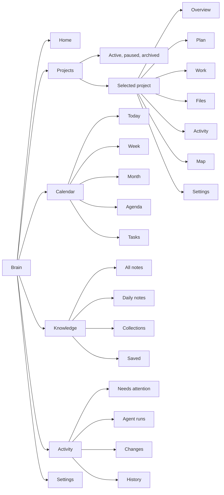
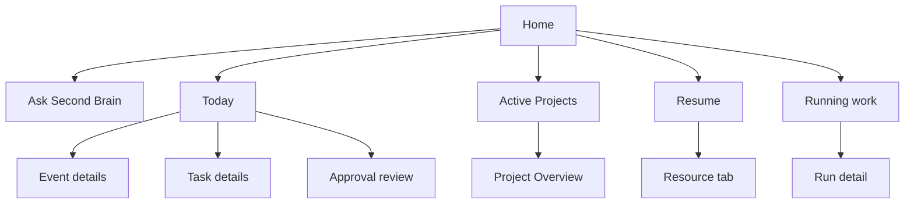

# Second Brain OS v1 navigation map

- Status: proposed v1 information architecture
- Companion: [`PRODUCT-BRIEF-V1.md`](./PRODUCT-BRIEF-V1.md)
- Implementation plan: [`IMPLEMENTATION-PLAN-V1.md`](./IMPLEMENTATION-PLAN-V1.md)
- Updated: 2026-08-22

## Navigation model

Second Brain OS has one global Brain. Projects live inside it. Registered local
roots remain security boundaries, but users reach them through Projects and
resources rather than a workspace switcher.

The shell has five navigation roles:

1. the primary rail changes product area;
2. the navigator changes the view or selected item inside that area;
3. the workbench displays the active view or open resources;
4. the inspector explains the current selection;
5. the utility panel holds temporary tools such as the agent, terminal, Git,
   problems, and calendar details.

## Primary hierarchy

## Primary rail

The rail contains:

1. Home
2. Projects
3. Calendar
4. Knowledge
5. Activity

Settings stays at the bottom. Badges are reserved for information that needs
action, such as approvals, failed sync, or recovery. The rail does not include
Files, Graph, Git, Terminal, or Agents as separate product areas.

## Top bar

The top bar contains:

- Back and Forward;
- a breadcrumb for Brain, Project, and resource;
- Create for a Project, note, task, or event;
- Ask to open the global agent panel;
- an attention indicator for approvals, sync failures, and recovery;
- panel controls.

The existing floating search field is removed. `Ctrl+K` opens global search.
`Ctrl+Shift+P` opens commands. Search and commands remain separate because they
answer different intents.

The existing workspace switcher is removed from normal navigation. Folder and
permission management moves to Project settings and Settings.

## Workbench and tabs

The workbench uses tabs for resources, not for every primary area. Supported
tab types include:

- Markdown note;
- source file;
- file preview;
- Git diff;
- agent Run;
- terminal session;
- saved Map lens.

Moving between Home, Projects, Calendar, Knowledge, and Activity changes the
main area without creating another tab. Opening a resource creates or focuses
its tab. The active Project remains visible in the breadcrumb and inspector.

## Home navigation

Home is a dashboard with direct paths to work:

Home cards show only populated or useful states. Detailed filtering and
history belong in their primary areas.

## Projects navigation

Projects opens the active Project list. Selecting a Project opens Overview.
The Project navigator contains:

- Overview
- Plan
- Work
- Files
- Activity
- Map

Project settings opens from the Project header or overflow menu rather than
occupying the daily workflow.

### Project transitions

- A Project card opens Overview.
- A milestone opens Plan with the milestone selected.
- A task opens Work with its details in the inspector.
- A file opens a resource tab while preserving Project context.
- A Run opens in a resource tab and remains listed in Project Activity.
- Map opens around the current Project or selected resource.

## Calendar navigation

Calendar defaults to Today. Its navigator contains Today, Week, Month, Agenda,
Tasks, Unscheduled, and Completed.

Selecting an event or task opens details in the inspector. Opening its source
Project or note moves to that context without losing the calendar selection
from history.

The calendar has one connection indicator. Account setup and detailed sync
diagnostics live in Settings, not in the calendar header.

## Knowledge navigation

Knowledge contains global notes and references. Its navigator contains All
notes, Daily notes, Collections, Saved, and a folder tree when needed.

Project files remain in Project Files. Global search can still find both
Knowledge and Project resources. Search results show their source Project or
global location.

## Activity navigation

Activity is the audit and attention area. Its navigator contains:

- Needs attention for approvals, conflicts, failed sync, and recovery;
- Agent runs for queued, running, blocked, and completed work;
- Changes for file, Git, task, calendar, and note mutations;
- History for the complete chronological record.

Activity rows link back to the affected Project and resource. It is a readable
event history, not a raw provider or terminal log.

## Global agent panel

Ask opens a utility panel without replacing the current work. It includes:

- prompt composer;
- current Project and selected resources;
- removable context chips;
- proposed tools and access;
- Run status and pending approval;
- links to changes and full Run detail.

The same panel can be opened from a Project, note, source file, task, calendar
item, Git change, or Map node. Context follows the current selection, but the
user can remove it before starting.

## Create menu

Create is available globally and offers:

- Project
- Note
- Task
- Calendar event

The menu uses the current Project as a default association when one is active.
Create Project always opens the dedicated setup flow.

## Settings hierarchy

Settings contains:

- General
- Connections
- Permissions
- Project locations
- Agent providers
- Data and recovery
- Diagnostics

Technical terms such as workspace IDs, correlation IDs, MCP versions, and
provider payloads appear only in advanced diagnostics.

## Responsive behavior

V1 targets desktop windows. At narrower widths:

- the primary rail remains available as icons;
- the navigator collapses before the workbench;
- the inspector and utility panel become overlays;
- breadcrumbs truncate from the middle;
- resource tabs scroll rather than shrink below a readable width.

The workbench must never place the navigator, inspector, and utility panel on
screen if doing so leaves the resource too narrow to use.

## Route ownership

| Destination | Owns navigation | Opens a resource tab |
|---|---|---|
| Home | Primary rail | No |
| Projects list | Primary rail and navigator | No |
| Project view | Project navigator | No |
| Calendar view | Primary rail and navigator | No |
| Knowledge list | Primary rail and navigator | No |
| Activity list | Primary rail and navigator | No |
| Note or file | Workbench | Yes |
| Git diff | Workbench | Yes |
| Agent Run | Workbench | Yes |
| Terminal session | Workbench or utility panel | Yes when promoted |
| Saved Map lens | Workbench | Yes |

## Migration from the current shell

1. Rename user-facing workspace registration to Project location where the
   root supports a Project.
2. Replace the workspace switcher with the Brain breadcrumb and Project
   navigation.
3. Replace the floating search field with the `Ctrl+K` search overlay.
4. Add Projects and Activity to the primary rail.
5. Move Agents into the global panel and Activity.
6. Move Graph into Project Map.
7. Stop opening primary product areas as tabs.
8. Keep resource tabs, history, the inspector, and the utility dock.
