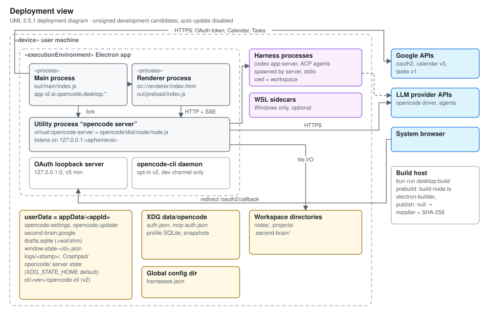

# Electron release operations

The active application lives in `opencode/`. Required checks run locally (see
`AGENTS.md`); the GitHub Actions workflows in `.github/workflows/` are disabled
in the repository settings to avoid Actions charges. Root Tauri/Cargo/pnpm
commands are retired; the former procedure is kept in
[the archive](archive/tauri/release-operations.md).



## Local checks

Use Bun 1.3.14 and Node.js 24. Install with `bun install --frozen-lockfile`
inside `opencode/`, then run these commands from the repository root:

```sh
bun run typecheck
bun run lint
bun run test
bun run test:engine
bun run build
```

The engine suites include operating-system and subprocess tests. Report their
actual result for each platform; a successful renderer build is not equivalent
to passing those tests. The inherited linter currently allows warnings.

## Unsigned Windows candidate

The **Unsigned Electron release candidate** workflow is disabled. Re-enable it
in the repository's Actions settings before running it manually. It builds
the development channel, packages the Windows app, writes SHA-256 checksums,
and retains the installer and checksum file as workflow artifacts for 14 days.
It does not publish a GitHub release or configure an update feed.

Locally on Windows, `bun run desktop:build` builds and packages the app with
publishing disabled. Output is under `opencode/packages/desktop/dist/`.
The build downloads the pinned upstream CLI for the optional development
sidecar and bundles the fork's local server. These are separate runtimes.

The product display name is Second Brain OS. Existing `ai.opencode.desktop.*`
application IDs and data paths are retained to preserve profile compatibility.
The `opencode:` URL scheme is also retained for existing links.

## Release limits

Automatic updates are disabled. Before enabling them, configure the fork's
own signed release feed and verify update and rollback behavior. Do not point
this fork at OpenCode's desktop releases.

This workflow produces unsigned development candidates only. macOS and Linux
packaging settings remain in the desktop package but have not been validated
by this Windows candidate workflow. A successful build does not establish
clean-machine installation, platform signing, or Google OAuth readiness.

Never bundle workspace data, local databases, credentials, `.env` files, logs,
or recovery archives. Preserve canonical files and existing application data
when upgrading. Donor Tauri databases have no automatic import path; see
[the donor record](archive/tauri/README.md).
