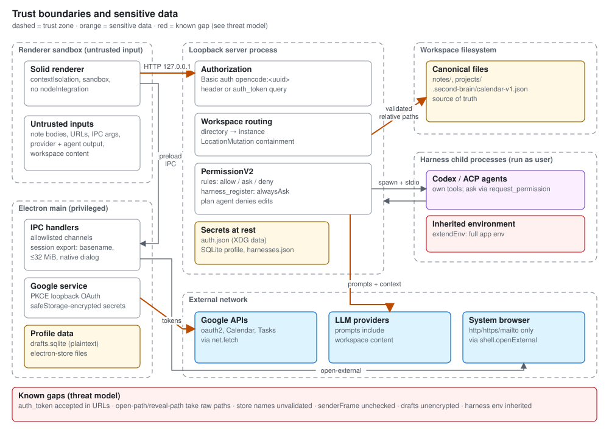

# Threat model for the active desktop app

This document covers the OpenCode Electron fork in `opencode/`. The former
React/Tauri application is retired, so its Rust policy and MCP
sidecar design are not current desktop controls.



Detailed permission and request flows are in
[the UML architecture views](../architecture/uml.md).

## Assets and boundaries

| Boundary                   | Current control and location                                                                                                                                                                                                                                                                                                                                           |
| -------------------------- | ---------------------------------------------------------------------------------------------------------------------------------------------------------------------------------------------------------------------------------------------------------------------------------------------------------------------------------------------------------------------- |
| Renderer to native process | The main window uses `contextIsolation`, `sandbox`, and disabled `nodeIntegration`. `opencode/packages/desktop/src/preload/index.ts` exposes specific IPC methods implemented in `opencode/packages/desktop/src/main/ipc.ts`.                                                                                                                                          |
| Renderer to managed server | Electron starts the OpenCode server on `127.0.0.1` with a generated password. Server authorization checks credentials for protected routes. See `opencode/packages/desktop/src/main/index.ts` and `opencode/packages/opencode/src/server/routes/instance/httpapi/middleware/authorization.ts`.                                                                         |
| Server to workspace files  | Second Brain handlers run in an instance location context. Note and project code resolves targets through `LocationMutation` before reading or writing files. See `opencode/packages/opencode/src/server/routes/instance/httpapi/handlers/second-brain.ts`, `opencode/packages/opencode/src/knowledge/note.ts`, and `opencode/packages/opencode/src/project/brain.ts`. |
| Desktop to Google          | Calendar and Tasks integration uses OAuth in the Electron main process. The service encrypts its client secret and refresh token with Electron `safeStorage` and disables connection when secure storage is unavailable. See `opencode/packages/desktop/src/main/google-calendar.ts`.                                                                                  |

Workspace notes, projects, calendar files, session data, provider tokens, and
agent tool permissions are sensitive. Treat note contents, provider responses,
workspace files, URL input, and IPC arguments as untrusted. Keep file access
within the selected workspace and use the existing mutation services. Never
log credentials or full private content.

## Credentials, extensions, and recovery

Google token encryption is specific to the desktop integration. It does not
establish encryption for every provider credential store. Provider
credentials (`auth.json`, `mcp-auth.json`) and the session database
(`opencode.db`) live in the XDG data directory (by default
`~/.local/share/opencode/`), outside Electron `userData`. `userData` holds
drafts, electron-store files, logs, and server state. Treat both locations as
sensitive and exclude them from source control and release artifacts.

Configured plugins execute code in the local runtime. Dependency installation
and plugin initialization can therefore affect both access and startup time.
Review plugin origins and package changes, retain the Bun lockfile and local
patches, and do not treat a plugin as sandboxed workspace content. Build and
packaging scripts also download upstream binaries, as described in
[release operations](../release-operations.md).

Workspace validation and agent tool permissions are different controls.
Keep the existing permission checks on tool execution; a user opening a note
does not authorize instructions embedded inside it. Destructive recovery must
preserve both canonical workspace files and session/draft profile state.

## Harness registration

A registered harness is a command that the app later runs as the user, with
the workspace as its working directory. `harness_register` validates the ID
and resolves the command to an absolute executable. Before running the
command at all, it asks for approval. The approval request shows the ID, name,
command, and arguments, and stores no "always allow" rule. The request uses
`alwaysAsk`, so configured or saved allow rules never skip the prompt; only a
deny rule changes the outcome. Plan mode denies `harness_register`. Only after
approval does the app run the ACP `initialize` handshake. It writes
`harnesses.json` (mode `0600`, atomic rename, serialized within the process)
only when the handshake succeeds.

The registry stores commands, arguments, and model IDs only. Agents can't
store environment variables or secrets in it, and it can't replace the
built-in `opencode` and `codex` instances. ACP agents get no client
file-system or terminal capability. Their own tool approvals arrive as
`session/request_permission` and use Second Brain permissions. Treat output
from an ACP agent as untrusted model output.

Known gap: ACP and Codex harness processes inherit the app's full environment
(`extendEnv: true`), plus any `env` set in user configuration. Any API key or
token in Second Brain's environment is therefore visible to every registered
harness. Agent CLIs often need their own credentials from the environment, so
the app doesn't filter it yet. Register only agents you'd trust with your shell
environment.

Availability probes start each enabled harness command for an `initialize`
handshake. Results are cached per instance configuration for 30 seconds so
picker refreshes don't relaunch every agent.

## Checks

From the repository root, `bun run typecheck` checks desktop, renderer, core,
and server types. `bun run test` checks desktop, renderer, and Second Brain
domains; `bun run test:engine` runs core and server suites. `bun run lint`
checks `opencode/`. These commands are defined
in the root `package.json`.
Relevant focused tests include
`opencode/packages/desktop/src/main/google-calendar-domain.test.ts`,
`opencode/packages/opencode/test/project/brain.test.ts`, and the note tests
under `opencode/packages/opencode/test/knowledge/`. Run server tests from
`opencode/packages/opencode` with Bun when changing those paths. These checks
run locally; GitHub Actions workflows are disabled. Local test results do not
establish cross-platform installer or signed-update safety.

Focused commands from `opencode/packages/opencode`:

```sh
bun run test ./test/knowledge ./test/planner ./test/project/brain.test.ts
bun run test ./test/server/httpapi-instance-route-auth.test.ts ./test/server/httpapi-ui.test.ts
```

From `opencode/packages/desktop`:

```sh
bun test src/main/google-calendar-domain.test.ts src/main/attachment-picker.test.ts src/main/external-url.test.ts
```

This is a source-level map of the controls found during setup, not a security
audit. Recheck the implementation and its tests before changing a boundary.

## Session export boundary

`save-session-export` accepts a JSON string and a basename, not a renderer
filesystem path. Main validates the basename, JSON syntax, and a 32 MiB size
limit, then asks the user to choose the destination with Electron's native
save dialog. Cancellation returns false; success follows the completed write.
This operation does not grant general renderer write access. Exports contain
private session content and are written only to the destination chosen by
the user. The IPC handler delegates validation and writing to
`packages/desktop/src/main/session-export.ts`.

Native session fork and diff endpoints use the existing session-location
middleware and authenticated HTTP boundary. Forks receive new message IDs;
opaque provider continuations and assistant filesystem snapshots are excluded
from the copied history. Review snapshots remain scoped to the session's
location and canonical Git worktree.

## Known gaps

Found during the 2026-10-02 scope audit. Paths are relative to
`opencode/packages/desktop/src/main/`. Entries move back into the model once a
fix lands.

- `open-path` (`ipc.ts`) opens any renderer-supplied absolute path.
  `reveal-path` reveals any existing absolute path. Neither uses a workspace ID
  or validated relative path. As of the 2026-10 batch-1 hardening, all IPC
  handlers reject senders outside the trusted main frame, `open-path` no longer
  executes renderer-supplied application paths (main resolves an application
  name through the registered-application lookup), and both handlers require
  absolute paths. Arbitrary-path opening from a compromised main-frame renderer
  remains open until the workspace-ID contract lands.
- `store-*` handlers now reject renderer-chosen store names outside a strict
  single-file-name pattern (`store-name.ts`), so renderer input can no longer
  create or escape files under `userData`. Main-process callers such as the
  Tauri migration are not renderer-controlled and remain unrestricted.
- IPC handlers now check `event.senderFrame` against the trusted main frame
  through the shared `trustedHandle`/`trustedOn` wrappers in `ipc.ts`.
- Server authorization also accepts an `auth_token` query parameter, so the
  credential can appear in URLs. `windows.ts` logs full blocked URLs.
- `drafts.sqlite` stores unsent draft content unencrypted in the profile.
