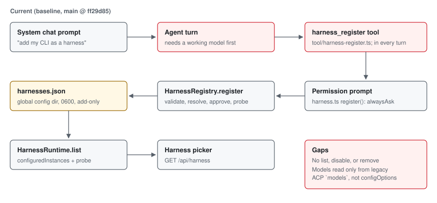
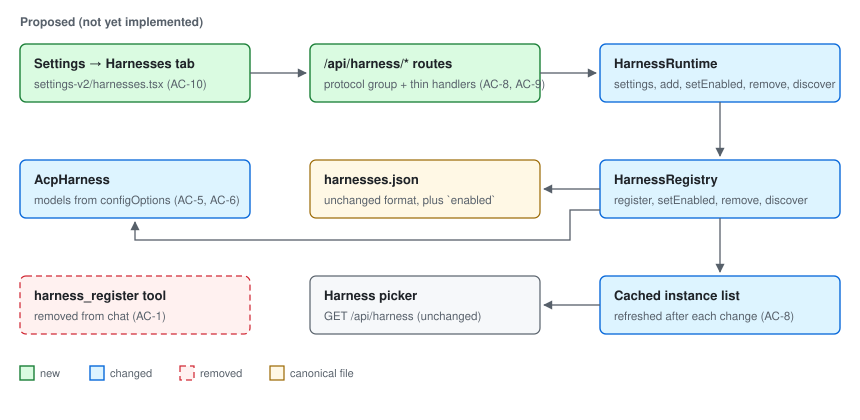
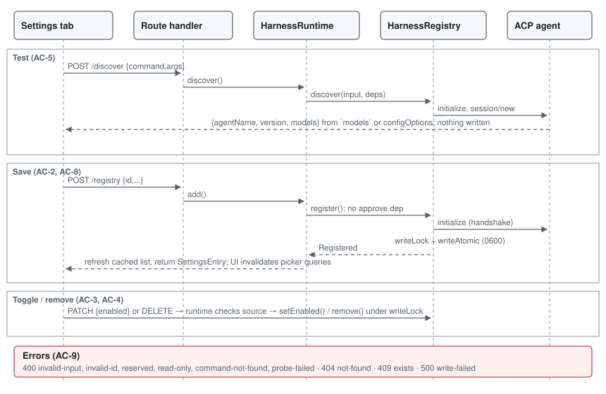

# Harness settings page

## Problem

ACP harnesses can only be added through the system chat. An agent calls the
`harness_register` tool, the user approves a permission prompt, and the
registry probes the command and writes `harnesses.json`. Three problems
follow:

- Adding a harness needs a working chat model. When the built-in harness
  can't reach its provider, as on 2026-10-07 with `opencode-go`, the user
  can't add the harness that would work around it.
- The tool's description and schema are sent with every system-chat turn for
  an action users take every few months.
- Nothing can list, disable, or remove a registered harness. Users edit
  `~/.config/opencode/harnesses.json` by hand.

A fourth gap appeared while registering `opencode acp` by hand. OpenCode
1.17 reports its models through the ACP `configOptions` field, and
`acp.ts` reads only the older `models` field. The picker therefore showed no
models until a `models` list was added to the entry by hand.

Expected behavior:

- Before: the user types "add `opencode acp` as a harness" into the chat. That
  works only if the chat model works. Afterwards the entry can't be managed.
- After: the user opens Settings → Harnesses and fills in the ID, name,
  command, and arguments. Test runs the ACP handshake and lists the agent's
  models. Save writes the entry, and the harness picker shows it without a
  restart. Each registered harness has enable/disable and remove controls.
  Built-ins and config-file harnesses are listed read-only. The chat no
  longer has a `harness_register` tool.

## Scope

In scope, all paths under `opencode/packages/`:

- Remove the chat tool:
  - Delete `core/src/tool/harness-register.ts` and its entry in
    `core/src/tool/builtins.ts`.
  - In `core/src/harness.ts`, remove `Interface.register`,
    `codexDynamicTools`, `handleCodexToolCall`, the `dynamicTools` on Codex
    `thread/start`, and the `register` parameter of `handleCodexRequest`.
  - Remove the `harness_register` rules in `core/src/plugin/agent.ts`.
  - In `core/src/harness/registry.ts`, remove the LLM-facing `description`,
    `inputJsonSchema`, `summary()`, and the `denied` reason.
  - Update the `harness_register` lists in
    `core/test/location-layer.test.ts` and delete the Codex dynamic-tool test
    in `core/test/harness-acp.test.ts`.
- Registry (`core/src/harness/registry.ts`):
  - `register` no longer takes an `approve` dependency.
  - Add `setEnabled`, `remove`, and `discover`, all under the existing
    `writeLock`, using the existing `writeAtomic`.
- ACP (`core/src/harness/acp.ts`): read models from either the `models` field
  or a `configOptions` entry of category `model`. Switch models with
  `session/set_model` or `session/set_config_option` to match.
- Runtime (`core/src/harness.ts`):
  - Add `settingsEntries()` beside `configuredInstances()`.
  - The `Interface` gets `settings`, `add`, `setEnabled`, `remove`, and
    `discover`.
  - Mutations refresh the cached `latest` list that `stream` and `driver`
    read.
- Schema: `schema/src/harness.ts` gains `SettingsEntry`, `Discovery`, and a
  typed settings error.
- HTTP: new endpoints in `protocol/src/groups/harness.ts`, with thin handlers
  in `server/src/handlers/harness.ts`.
- Renderer (`app/src/`):
  - New `components/settings-v2/harnesses.tsx`, a tab in
    `dialog-settings-v2.tsx` after Models, and an add dialog.
  - Fetch helpers in `utils/server.ts`.
  - English strings under `harness.settings.*` in `i18n/en.ts`. That prefix is
    exempt from the locale parity test, so other locales fall back to
    English.
- Docs, in the same change, per `AGENTS.md`:
  - `docs/architecture/README.md` (harness registration section).
  - `docs/security/threat-model.md` (harness registration section).
  - `docs/product/NAVIGATION-MAP-V1.md` (settings hierarchy).
  - `docs/architecture/uml.md` (coverage index: harness registry,
    `harnesses.json` writers, renderer routing).
  - `docs/diagrams/generate/structural.py`, then regenerate
    `trust-boundaries.svg` and `component-overview.svg`.
  - `docs/diagrams/generate/behavioral.py`, if `HarnessInstance` changes.

Existing interfaces to reuse:

- `HarnessRegistry.read`, `writeAtomic`, `writeLock`, `resolveCommand`, and
  `fileName`.
- `AcpHarness.handshake`, `connect`, `decodeSettings`, and `configuredModels`.
- `configuredInstances`, for merge order.
- `Location.response` and `LocationQuery`, for route shape.
- The Providers tab (`settings-v2/providers.tsx`), for page layout, toasts,
  and `SettingsListV2`.
- `listHarnessesForServer` (`app/src/utils/server.ts`), for authenticated
  fetches.

Exclusions:

- Installing agent CLIs.
- Editing an existing entry's command or arguments; remove and re-add it.
- Editing config-file `harnesses` entries.
- Per-harness environment variables in the form. `env` remains config-file
  only.
- The built-in OpenCode harness credential gap (`auth.json` versus the
  credential table). That is a separate change.

Invariants to preserve:

- `opencode` and `codex` can't be replaced, disabled, or removed.
- A config-file entry overrides a registry entry with the same ID, and it is
  read-only in Settings.
- `harnesses.json` keeps its format, mode `0600`, atomic writes, and
  serialized writers. A malformed file is never overwritten.
- Only an ACP handshake runs before saving. Nothing is written when it fails.
- No secrets or environment variables are stored. Spawned agents receive only
  the `harnessEnvironment` allowlist.
- Electron IPC is unchanged. The renderer talks to the local server over the
  existing authenticated HTTP API.

## Feature map

| Node | Responsibility | Current source |
|---|---|---|
| Chat tool | Agent-initiated registration | `core/src/tool/harness-register.ts`; `core/src/harness.ts` `register`, `codexDynamicTools` |
| Registry | Validate, probe, write `harnesses.json` | `core/src/harness/registry.ts` `register`, `read` |
| Runtime list | Merge built-ins, registry, config; probe | `core/src/harness.ts` `configuredInstances`, `instances`, `latest` |
| ACP models | Model list and switching | `core/src/harness/acp.ts` `parseModels`, `currentModel`, `setModel` |
| List route | Picker data | `protocol/src/groups/harness.ts` `harness.list`; `server/src/handlers/harness.ts` |
| Picker | Choose harness and model | `app/src/components/prompt-input/harness-controller.ts`; `app/src/pages/brain-home.tsx` |
| Settings | Tabs and pages | `app/src/components/settings-v2/dialog-settings-v2.tsx` |

Indirect dependencies:

- `stream()` and `driver()` read the cached `latest` list. A disable or remove
  must refresh it, or the next turn still uses the old entry.
- The probe cache is keyed by instance config and not by `enabled`. A
  disabled instance must report unavailable through `driverFor`, which
  already checks `enabled`.
- Brain home caches harnesses for 30 seconds under
  `["home", "harnesses", ...]`. The prompt picker refetches on open, select,
  or refresh.

## Diagrams

Current (baseline `main` @ `ff29d85`):



Proposed (not yet implemented):



Implementation detail:



## Contract

Tests in both sets depend only on these names and shapes.

`HarnessRegistry` (`core/src/harness/registry.ts`):

- `register(input, { configDir, directory, existing, process })` behaves as
  today with no approval step. It returns `{ id, name, command, args,
  agentName?, version? }`.
- `setEnabled(configDir, id, enabled)` and `remove(configDir, id)` return
  `Effect<void, RegisterError>`.
  - A reserved ID fails with `reserved`.
  - An ID missing from the file fails with `not-found`.
  - A malformed or unwritable file fails with `write-failed`, and the file is
    left unchanged.
  - Other entries and fields are preserved.
  - Removing the last entry leaves `{}`.
- `discover({ command, args? }, { directory, process })` returns
  `{ command, args, agentName?, version?, models: Harness.Model[] }`.
  - The returned `command` is the resolved absolute path.
  - It runs `initialize` and then `session/new` in `directory`, and writes
    nothing.
  - It fails with `invalid-input`, `command-not-found`, or `probe-failed`.
  - An agent that reports no models gives `models: []`.
- `RegisterError.reason` adds `not-found` and drops `denied`.

`AcpHarness` (`core/src/harness/acp.ts`):

- `open()` lists models from `models.availableModels`. Without that, it uses
  the first `configOptions` entry with `category: "model"` and
  `type: "select"`.
  - `isDefault` marks `currentModelId` or `currentValue`.
- A turn with a different model calls `session/set_model` for the legacy
  shape. For the `configOptions` shape it calls
  `session/set_config_option { sessionId, configId, value }`.

`HarnessRuntime` (`core/src/harness.ts`):

- `settingsEntries(entries, registry)` returns
  `Harness.SettingsEntry[]`. Each entry has `{ id, driver, name, enabled,
  source, editable, command?, args?, models? }`.
  - `source` is `"built-in"`, `"registry"`, or `"config"`. `editable` is true
    only for `"registry"`.
  - The order matches `configuredInstances`.
- The `Service` interface replaces `register` with `settings()`, `add()`,
  `setEnabled()`, `remove()`, and `discover()`.
  - `setEnabled` and `remove` fail with `read-only` for a config-sourced ID
    and with `reserved` for a built-in.
  - Every successful mutation refreshes the cached instance list.

HTTP. All routes take the existing `location[directory]` query. Successes
return `{ location, data }`. Errors return JSON with `reason` and `message`.

| Method and path | Body | Success `data` |
|---|---|---|
| `GET /api/harness/settings` | none | `SettingsEntry[]` |
| `POST /api/harness/discover` | `{ command, args? }` | `Discovery` |
| `POST /api/harness/registry` | `{ id, name?, command, args?, models? }` | `SettingsEntry` |
| `PATCH /api/harness/registry/{id}` | `{ enabled }` | `SettingsEntry` |
| `DELETE /api/harness/registry/{id}` | none | `{ id }` |

The status for each error reason:

| Status | Reasons |
|---|---|
| 400 | `invalid-input`, `invalid-id`, `reserved`, `read-only`, `command-not-found`, `probe-failed`; a body that fails schema decoding is also 400 |
| 404 | `not-found` |
| 409 | `exists` |
| 500 | `write-failed` |

## Acceptance criteria

- **AC-1 Tool removed.** `harness_register` no longer exists as a builtin
  tool, a Codex dynamic tool, or a permission rule. Codex `thread/start`
  sends no `dynamicTools`.
- **AC-2 Register from settings.** Registration needs no approval callback.
  It validates, resolves the command, runs the handshake, and writes the
  entry. All of today's rejections still apply.
- **AC-3 Enable and disable.** Disabling stores `enabled: false` and keeps
  every other field. Enabling restores it. A disabled entry still reserves its
  ID. Built-ins fail with `reserved`, unknown IDs with `not-found`, and a
  malformed file with `write-failed` (the file is untouched).
- **AC-4 Remove.** Removing deletes only that entry. Removing the last entry
  leaves `{}`. The same error rules as AC-3 apply. A removed ID can be
  registered again.
- **AC-5 Discover.** Test reports the agent name, version, and models from
  either model field without writing anything. A command that isn't ACP gives
  `probe-failed`, and one that can't be resolved gives `command-not-found`.
  An agent that reports no models gives an empty list.
- **AC-6 configOptions models.** ACP sessions list models from
  `configOptions` and mark the current value as the default. They switch with
  `session/set_config_option`. Agents that use the legacy `models` field keep
  using `session/set_model`.
- **AC-7 Settings entries.** Each entry is labeled `built-in`, `registry`, or
  `config`, and only registry entries are editable. A config entry shadows a
  registry entry with the same ID, which appears once. Registry entries using
  reserved IDs are ignored.
- **AC-8 Routes and live picker.**
  - The five routes behave as in the contract.
  - After an add, disable, enable, or remove, the next `GET /api/harness`
    reflects the change without a restart. A disabled entry is
    `unavailable`, and a removed entry is gone.
  - Entries persist across an instance restart.
- **AC-9 Route errors.**
  - Status codes and reasons follow the contract.
  - Config-file harnesses return 400 `read-only` for PATCH and DELETE.
  - A failed probe or a bad body writes nothing.
- **AC-10 Settings UI (manual evidence).**
  - Settings shows a Harnesses tab after Models. Built-ins and config entries
    are labeled read-only. Registry entries have an enable switch and a
    Remove action, and Remove asks for confirmation.
  - The add dialog has ID, name, command, and arguments fields. Test shows the
    agent name, version, and models, or the error message. Save is enabled
    only after a successful Test with the same command and arguments.
  - After Save, toggle, or remove, the harness picker shows the change when it
    is next opened, and Brain home's harness query is invalidated.
  - Errors appear as toasts using the server's `message`.
- **AC-11 Docs.** The architecture, threat model, navigation map, UML
  coverage index, and the regenerated diagrams describe Settings-based
  registration. None of them mention `harness_register`.

| Criterion | Acceptance tests | Verification tests | Manual |
|---|---|---|---|
| AC-1 | `acceptance/registry-settings.test.ts` | none (plus repo tests: `location-layer.test.ts`) | grep check |
| AC-2 | `acceptance/registry-settings.test.ts` | `verification/registry-settings.verify.test.ts` | |
| AC-3 | both core files | both core files | |
| AC-4 | `acceptance/registry-settings.test.ts` | `verification/registry-settings.verify.test.ts` | |
| AC-5 | `acceptance/registry-settings.test.ts`, `acceptance/routes.test.ts` | `verification/registry-settings.verify.test.ts` | |
| AC-6 | `acceptance/registry-settings.test.ts` | `verification/registry-settings.verify.test.ts` | |
| AC-7 | `acceptance/registry-settings.test.ts` | `verification/registry-settings.verify.test.ts` | |
| AC-8 | `acceptance/routes.test.ts` | `verification/routes.verify.test.ts` | |
| AC-9 | `acceptance/routes.test.ts` | `verification/routes.verify.test.ts` | |
| AC-10 | none | none | yes: app walkthrough with screenshots |
| AC-11 | none | none | yes: review the doc diff, grep for `harness_register` |

## Implementation sequence

1. **ACP models (AC-6).** Parse `configOptions`, track which shape the
   session uses, and switch with the matching method. This can be done on
   its own.
2. **Registry (AC-2 to AC-5).** Drop `approve`, then add `setEnabled`,
   `remove`, and `discover`, all under `writeLock`. `discover` reuses
   `connect` and `session/new` with the step 1 parser. Depends on 1.
3. **Runtime and schema (AC-7, AC-8).** Add `settingsEntries` and the
   `SettingsEntry`/`Discovery` schemas. Replace `register` in the
   `Interface`, and refresh `latest` after mutations. Depends on 2.
4. **Remove the tool (AC-1).** Delete the tool, the Codex dynamic tool, and
   the permission rules, and update the two repository tests. This can follow
   3 directly.
5. **Routes (AC-8, AC-9).** Add the protocol endpoints, a typed error schema
   with statuses, and thin handlers. Depends on 3.
6. **Settings UI (AC-10).** Add the tab, page, add dialog, fetch helpers, and
   `harness.settings.*` strings. After mutations, invalidate
   `["home", "harnesses"]` and make the prompt picker refetch when opened.
   Depends on 5.
7. **Docs and diagrams (AC-11).** Regenerate the SVGs with the existing
   generator scripts.

## Verification

Setup, once per checkout. The `node_modules` link is gitignored by
`implementations/*/node_modules`:

```sh
cd "Implementations/harness-settings-page" && ln -s ../../opencode/packages/opencode/node_modules node_modules
```

Core tests run from `opencode/packages/core`:

```sh
bun test ../../../Implementations/harness-settings-page/acceptance/registry-settings.test.ts
bun test ../../../Implementations/harness-settings-page/verification/registry-settings.verify.test.ts
```

Route tests run from `opencode/packages/opencode`. Its `test/preload.ts`
isolates `XDG_CONFIG_HOME`, so `harnesses.json` is a temp file:

```sh
bun test --timeout 30000 ../../../Implementations/harness-settings-page/acceptance/routes.test.ts
bun test --timeout 30000 ../../../Implementations/harness-settings-page/verification/routes.verify.test.ts
```

The fixture `fixtures/fake-acp-agent.ts` is a deterministic ACP agent run
with `process.execPath`. It needs no network or provider. Its scenarios are
`models`, `config-options`, `no-models`, and `not-acp`. Each prompt replies
`model:<current>`, so tests can see which switch method took effect.

Repository checks from the root: `bun run typecheck`, `bun run lint`,
`bun run test`, `bun run test:engine`, and `bun run build`.
`bun run test:routes` doesn't cover settings, so it is optional.

Manual check for AC-10: run `bun run dev`, then:

1. Open Settings → Harnesses.
2. Add `opencode-cli` with the absolute path to `opencode` and the argument
   `acp`.
3. Test, then confirm `opencode-go/glm-5.3-flash` is listed.
4. Save, then confirm the harness picker lists it.
5. Disable it, then confirm the picker shows it unavailable.
6. Remove it, then confirm it's gone.
7. Confirm Built-in OpenCode and Codex have no controls.

Take a screenshot at each step.

Baseline (2026-10-07, branch `feat/harness-settings-page` at `ff29d85`, test
files only):

| Run | Result |
|---|---|
| `acceptance/registry-settings.test.ts` | 0 pass, 10 fail. Missing exports (`discover`, `setEnabled`, `settingsEntries`), `deps.approve is not a function`, the tool still present, configOptions models empty |
| `acceptance/routes.test.ts` | 0 pass, 6 fail, all with 404 for the new routes. Sanity check: the existing `GET /api/harness` returns 200 through the same helper |
| `verification/registry-settings.verify.test.ts` | 1 pass, 9 fail. The pass is legacy `set_model` switching, which already works and is kept as a regression guard |
| `verification/routes.verify.test.ts` | 0 pass, 6 fail, all with 404. Sanity check: a project `opencode.json` harness appears in `GET /api/harness`, so the read-only fixture is valid |

## Security notes

- Registration moves from an agent tool behind a permission prompt to an
  explicit user action in Settings, over the existing authenticated local
  HTTP API. Prompt-injected workspace content can no longer cause a
  registration.
- `discover` and `add` spawn a user-specified executable. The local API
  already exposes process execution to authenticated clients through PTY
  routes, so this adds no new capability class. These limits stay in force:
  - Absolute path resolution only.
  - Argument arrays with no shell.
  - The `harnessEnvironment` allowlist.
  - The 8 s handshake timeout.
  - The process is killed after the probe.
  - Nothing is stored except the entry itself.
- `discover` calls `session/new`, so agents such as OpenCode may record an
  empty session in their own history. This is documented as expected.

## Completion evidence

Not started. This package contains the plan, the fixture, and both test sets,
all written by the same agent. If that agent also implements the change, the
verification set is a separately designed check of the contract, not an
independently authored one.
